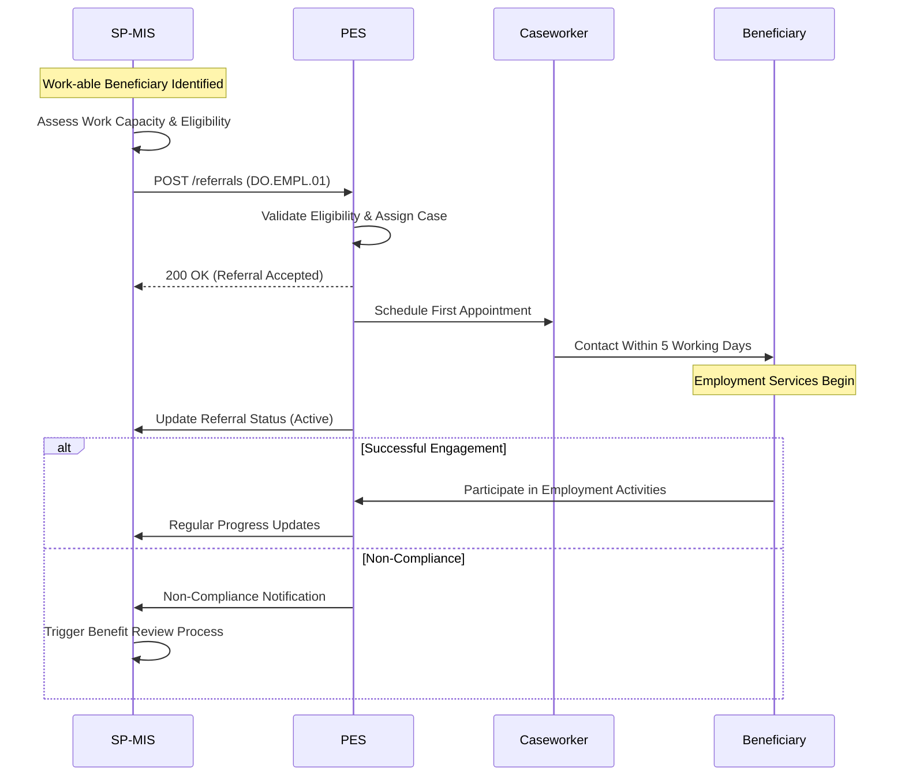

# PRS.EMPL.01 — Employment Referral Process

**Use Case**: Support social assistance beneficiaries to find employment through referral to PES services

## 📊 **Evidence Base from ILO Analysis**

### **Countries with Implementation**
1. **Chile** - RSH to SENCE automatic referral system with ClaveÚnica integration
2. **South Korea** - Work24 platform with KEIS-NBLSS unified employment referral
3. **Colombia** - Empleo Inclusivo (SA beneficiary activation)
4. **Turkey** - İŞKUR-ISAF integrated referral system for SA beneficiaries
5. **Philippines** - Sustainable Livelihood Program
6. **Kosovo** - EMIS and SAS fully integrated system
7. **Albania** - SA to PES referral coordination
8. **India** - National Career Service referral system

### **Digital Integration Maturity**
- **Advanced**: Chile, South Korea (real-time API integration with comprehensive digital ecosystems)
- **High**: Turkey, Kosovo (fully integrated systems)
- **Medium**: Colombia, Philippines (manual to automated transition)
- **Developing**: Albania, India (basic referral processes)

## 🎯 **Use Case Definition**

### **Actors**
- **Primary**: SP-MIS (Social Protection Management Information System)
- **Secondary**: PES (Public Employment Services)
- **Supporting**: Social Registry, Beneficiary, Caseworker

### **Trigger**
- Work-able beneficiary identified in SP system
- Conditionality requirement for continued benefits
- Voluntary request for employment services
- Periodic review triggering activation requirement

### **Objective**
Enable automated or semi-automated referral of work-able social assistance beneficiaries to appropriate PES services based on:
- Socio-economic vulnerability assessment
- Work capacity evaluation
- Skills and employment history
- Geographic accessibility to services

## 🔄 **Process Flow Design (DCI Pattern)**



### **Process Flow 1: Standard Employment Referral**
**File**: `processflow1req.json` / `processflow1res.json`
**Pattern**: IBR Beneficiary Enrollment (adapted)

#### **Request Structure**
```json
{
  "signature": "DCI standard signature",
  "header": {
    "version": "1.0.0",
    "message_id": "550e8400-e29b-41d4-a716-446655440000",
    "message_ts": "2025-09-15T14:30:00.000Z",
    "action": "referral_create",
    "sender_id": "SP-MIS-CHILE",
    "receiver_id": "PES-SENCE",
    "total_count": "1",
    "is_msg_encrypted": false
  },
  "message": {
    "transaction_id": "550e8400-e29b-41d4-a716-446655440001",
    "employment_referral_request": [
      {
        "reference_id": "550e8400-e29b-41d4-a716-446655440002",
        "timestamp": "2025-09-15T14:30:00.000Z",
        "referral_criteria": {
          "version": "1.0.0",
          "referral_type": "unemployment_benefit_activation",
          "person": {
            "@context": "https://schema.spdci.org/employment/v1/",
            "@type": "Person",
            "identifiers": [
              {
                "identifier_type": "national_id",
                "identifier_value": "12345678901"
              }
            ],
            "name": {
              "given_name": "Maria",
              "surname": "Rodriguez"
            },
            "birth_date": "1985-03-15",
            "addresses": [
              {
                "address_type": "residential",
                "locality": "Santiago",
                "region_code": "RM",
                "country_code": "CL"
              }
            ]
          },
          "source_programme": {
            "@type": "ibr:Programme",
            "programme_identifier": "SP-CASH-2024",
            "programme_name": "Family Emergency Income",
            "implementing_institution": "Ministry of Social Development"
          },
          "work_capacity_assessment": {
            "assessment_date": "2025-09-10",
            "work_able": true,
            "restrictions": ["part_time_only"],
            "skills": ["basic_literacy", "customer_service"],
            "work_preferences": {
              "preferred_sectors": ["retail", "services"],
              "geographic_mobility": "local_only",
              "availability": "immediate"
            }
          },
          "referral_reason": "unemployment_benefit_activation",
          "target_pes_office": "PES-SANTIAGO-CENTRO",
          "compliance_requirements": {
            "job_search_obligation": true,
            "training_participation": "recommended",
            "reporting_frequency": "monthly"
          }
        },
        "consent": {
          "consent_given": true,
          "consent_date": "2025-09-14T10:00:00.000Z",
          "consent_type": "employment_services",
          "legal_basis": "social_protection_law_2023"
        },
        "locale": "es-CL"
      }
    ]
  }
}
```

#### **Response Structure**
```json
{
  "signature": "DCI standard signature",
  "header": {
    "version": "1.0.0",
    "message_id": "550e8400-e29b-41d4-a716-446655440003",
    "message_ts": "2025-09-15T14:30:05.000Z",
    "action": "referral_response",
    "sender_id": "PES-SENCE",
    "receiver_id": "SP-MIS-CHILE",
    "total_count": "1",
    "is_msg_encrypted": false
  },
  "message": {
    "transaction_id": "550e8400-e29b-41d4-a716-446655440001",
    "correlation_id": "550e8400-e29b-41d4-a716-446655440004",
    "employment_referral_response": [
      {
        "reference_id": "550e8400-e29b-41d4-a716-446655440002",
        "timestamp": "2025-09-15T14:30:05.000Z",
        "status": "succ",
        "status_reason_code": "REFERRAL_ACCEPTED",
        "status_reason_message": "Referral successfully accepted and case assigned",
        "data": {
          "referral_id": "550e8400-e29b-41d4-a716-446655440005",
          "pes_case_number": "SENCE-2025-001234",
          "assigned_caseworker": "caseworker:789",
          "caseworker_name": "Ana Martinez",
          "appointment_scheduled": "2025-09-20T10:00:00.000Z",
          "pes_office_contact": {
            "office_name": "SENCE Santiago Centro",
            "address": "Av. Libertador 1234, Santiago",
            "phone": "+56-2-12345678",
            "email": "santiago.centro@sence.cl"
          },
          "next_steps": [
            "attend_initial_appointment",
            "complete_skills_assessment",
            "begin_job_search_activities",
            "register_on_bne_platform"
          ],
          "compliance_schedule": {
            "initial_meeting": "2025-09-20T10:00:00.000Z",
            "skills_assessment": "2025-09-25T14:00:00.000Z",
            "first_progress_review": "2025-10-20T10:00:00.000Z"
          }
        },
        "locale": "es-CL"
      }
    ]
  }
}
```

## 🌍 **Country Implementation Variants**

### **Process Flow 1-Chile: RSH Integration Model**
**File**: `processflow1-chile-req.json`
**Specific Features**:
- Real-time RSH socio-economic classification verification via Government Interoperability Platform
- SENCE system integration with automated eligibility pre-checks
- Multiple entry points: Ventanilla Única Social, ChileAtiende, OMIL network (315 offices)
- ClaveÚnica single sign-on authentication
- Integration with SII (tax authority), Previred (social security), Civil Registry

**Technical Architecture**:
```json
{
  "chile_technical_integration": {
    "interoperability_platform": "Plataforma de Interoperabilidad del Estado",
    "authentication": {
      "method": "clave_unica",
      "single_sign_on": true,
      "government_digital_id": true
    },
    "rsh_integration": {
      "query_type": "real_time_api",
      "vulnerability_classification": "7_bracket_system",
      "socioeconomic_score": "cse_composite_score",
      "data_sources": [
        "civil_registry",
        "sii_tax_records",
        "fonasa_health_records",
        "education_databases",
        "self_reported_surveys"
      ]
    },
    "verification_systems": {
      "identity_verification": "registro_civil_e_identificacion",
      "income_verification": "sii_tax_authority",
      "employment_verification": "previred_social_security",
      "benefit_verification": "ips_social_security_institute"
    },
    "entry_channels": [
      "sence_online_platform",
      "ventanilla_unica_social",
      "chileatiende_portal",
      "omil_municipal_offices"
    ]
  }
}
```

**Enhanced Data Elements**:
```json
{
  "chile_specific": {
    "rsh_classification": {
      "vulnerability_percentile": 35,
      "vulnerability_bracket": 1,
      "socioeconomic_score": 8547.32,
      "last_updated": "2025-09-01",
      "data_quality_score": "high",
      "administrative_data_percentage": 87
    },
    "employment_subsidies": {
      "sej_youth_subsidy": {
        "eligible": true,
        "age_range": "18_to_24",
        "subsidy_rate": 30,
        "max_monthly_amount": 198704,
        "employer_incentive": "one_third_of_worker_benefit"
      },
      "smt_women_subsidy": {
        "eligible": false,
        "reason": "age_below_25",
        "future_eligibility_date": "2027-03-15"
      }
    },
    "digital_verification": {
      "income_threshold_check": "below_662348_monthly",
      "contribution_compliance": "verified_via_previred",
      "tax_compliance": "verified_via_sii"
    },
    "process_efficiency": {
      "pre_check_duration": "30_seconds",
      "application_processing": "24_hours",
      "first_payment": "within_30_days"
    }
  }
}
```

### **Process Flow 1-South Korea: Work24 Integration Model**
**File**: `processflow1-korea-req.json`
**Specific Features**:
- Work24 unified platform integration (9 previously separate systems)
- Employment Welfare Plus Centres co-located service delivery
- KEIS-NBLSS real-time data sharing
- AI-enhanced job matching through WorkNet
- Integrated case management across employment and welfare services

**Technical Architecture**:
```json
{
  "korea_technical_integration": {
    "unified_platform": "work24_portal",
    "integrated_systems": [
      "worknet_job_matching",
      "hrd_net_training",
      "employment_insurance_portal",
      "nesp_disadvantaged_support"
    ],
    "ai_capabilities": {
      "job_matching": "skills_based_ml_algorithm",
      "training_recommendation": "career_pathway_optimization",
      "employer_connection": "automated_candidate_ranking"
    },
    "physical_integration": {
      "employment_welfare_plus_centres": 100,
      "total_employment_centres": 174,
      "co_location_model": "moel_mhw_municipal_integration"
    },
    "case_management": {
      "unified_client_dashboard": true,
      "cross_system_case_notes": true,
      "electronic_referral_system": true,
      "consultive_case_groups": "multi_agency_coordination"
    }
  }
}
```

### **Process Flow 1-Turkey: İŞKUR Integration Model**
**File**: `processflow1-turkey-req.json`
**Specific Features**:
- ISAF social assistance database integration
- İŞKUR employment services coordination
- Women from low-income household targeting
- Phased integration approach (2020-2024)
- E-Government platform integration

### **Process Flow 1-Kosovo: Integrated Case Management**
**File**: `processflow1-kosovo-req.json`
**Specific Features**:
- EMIS-SAS fully integrated system
- Unified case management approach
- Single point of service delivery

## 📋 **Data Objects Mapping**

### **Primary Data Object**: `DO.EMPL.01 — Employment Referral`
- **Person Information**: Uses `DO.COM.Person` with employment-relevant attributes
- **Programme Context**: Uses IBR `Programme` structure for source SP programme
- **Work Assessment**: Employment-specific capability and preference data
- **Compliance Requirements**: Employment obligations for benefit continuation

### **Code Directories Used**:
- `CD.EMPL.02 — ReferralReason`: unemployment_benefit_activation, skills_mismatch, etc.
- `CD.COM.01 — RequestStatus`: rcvd, pdng, succ, rjct
- `CD.EMPL.09 — ComplianceStatus`: For ongoing monitoring requirements

## 🔧 **API Implementation**

### **Endpoint Mapping**
```
POST /referrals → processflow1 (Employment Referral Creation)
├── Standard implementation: processflow1req.json
├── Chile variant: processflow1-chile-req.json
├── Turkey variant: processflow1-turkey-req.json
└── Kosovo variant: processflow1-kosovo-req.json
```

### **Business Rules**
1. **Eligibility Verification**:
   - Person must be assessed as work-able
   - Must be active beneficiary of source SP programme
   - Must fall within age and capability requirements

2. **Geographic Matching**:
   - Target PES office must serve person's residential area
   - Consider transportation accessibility and mobility constraints

3. **Consent Requirements**:
   - Explicit consent required for employment service participation
   - Legal basis must be documented and valid
   - Consent withdrawal mechanisms available

4. **Data Minimization**:
   - Only share data necessary for employment service delivery
   - Exclude sensitive medical or family information not relevant to employment

## 📊 **Success Metrics & KPIs**

### **Process Efficiency**
- **Referral Processing Time**: < 24 hours for automated acceptance
- **Case Assignment Time**: < 48 hours to caseworker assignment
- **First Appointment Scheduling**: Within 5 business days

### **Quality Indicators**
- **Referral Acceptance Rate**: > 95% for eligible beneficiaries
- **No-Show Rate**: < 20% for initial appointments
- **Service Completion Rate**: > 60% complete initial assessment

### **Compliance Tracking**
- **Legal Basis Documentation**: 100% of referrals have valid legal basis
- **Consent Coverage**: 100% of referrals have documented consent
- **Audit Trail Completeness**: 100% of transactions logged and traceable

## ⚠️ **Implementation Challenges**

### **Technical Challenges**
1. **System Integration Complexity**: Multiple systems with different data formats
2. **Real-time Processing Requirements**: Immediate response expectations
3. **Data Quality Issues**: Incomplete or outdated beneficiary information

### **Governance Challenges**
1. **Inter-institutional Coordination**: Different agencies with different priorities
2. **Legal Framework Alignment**: Varying data protection and sharing regulations
3. **Capacity Constraints**: Limited PES resources for increased referral volume

### **User Experience Challenges**
1. **Multi-channel Access**: Beneficiaries use different access points
2. **Language and Literacy Barriers**: Complex processes for vulnerable populations
3. **Digital Divide**: Limited internet access and digital skills

## 🎯 **Implementation Recommendations**

### **Phase 1: Foundation** (Weeks 1-2)
1. Establish legal agreements between SP and PES agencies
2. Define data sharing protocols and security requirements
3. Create pilot program with limited geographic scope

### **Phase 2: Technical Integration** (Weeks 3-6)
1. Implement API endpoints following DCI pattern
2. Develop country-specific process flow variants
3. Create testing scenarios with sample data

### **Phase 3: Pilot Implementation** (Weeks 7-10)
1. Launch pilot in selected geographic area
2. Monitor referral quality and success rates
3. Gather feedback from beneficiaries and caseworkers

### **Phase 4: Scale-up** (Weeks 11-12)
1. Expand to additional geographic areas
2. Implement lessons learned from pilot
3. Establish ongoing monitoring and evaluation framework

---

**Next**: [PRS.EMPL.02 — Status Verification](./prs-empl-02-status-verification.md)