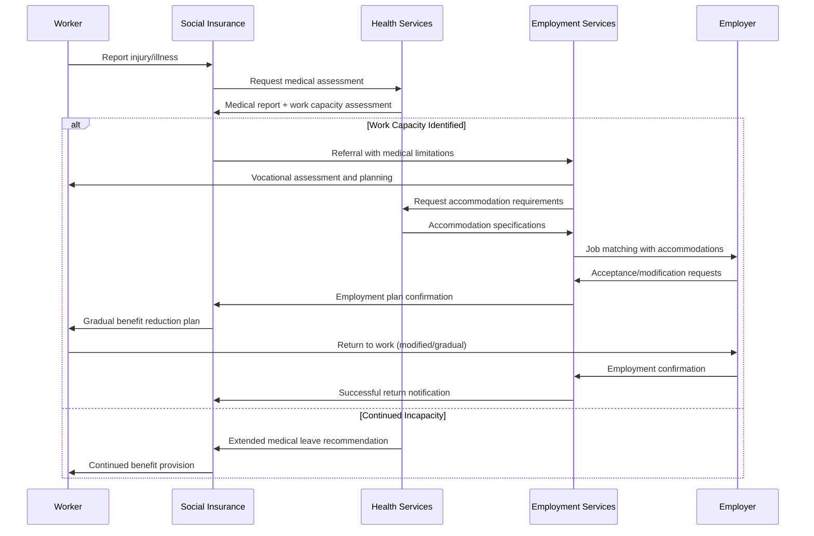

# PRS.EMPL.06 — Return to Work Process

**Process Standard**: Supporting return to work after employment injury, illness, or extended absence

## Overview

**Objective**: Enable coordinated support for workers returning to employment following illness, injury, parental leave, or disability through integrated service delivery across PES, Social Insurance, and Health systems.

**Actors**: Social Insurance Agency, PES, Health/Rehabilitation Services, Employer, Worker

**Evidence Base**: Malaysia (PERKESO Return to Work), Austria (fit2work), Germany (comprehensive rehabilitation services)

## Use Case Description

**Primary Scenario**: Workers face challenges returning to employment following work-related injuries, illness, or extended leave. Effective return-to-work strategies require coordinated support across multiple systems to ensure successful reintegration into the labour market.

**Integration Points**:
- **Social Insurance → PES**: Medical assessments, return-to-work potential status
- **PES → Social Insurance**: Individual employment plans, job placement status
- **Health Services → Both**: Medical clearance, accommodation requirements
- **All Systems → Employer**: Coordination for workplace modifications and gradual return

## Process Flow



## Preconditions

**System Requirements**:
- Medical assessment system with work capacity evaluation
- PES vocational rehabilitation capabilities
- Employer accommodation protocols
- Coordinated case management across agencies

**Data Requirements**:
- Worker health and disability status
- Previous employment history and skills
- Medical limitations and accommodation needs
- Available job opportunities with modification potential

**Legal Framework**:
- Return to work legislation and obligations
- Employer accommodation requirements
- Medical privacy and sharing protocols
- Social insurance benefit continuation rules

## Data Exchange Patterns

### Core Data Objects

**Medical Assessment Data** (Health → SI → PES):
```json
{
  "assessment_id": "uuid",
  "worker_id": "string",
  "assessment_date": "date",
  "work_capacity": {
    "physical_limitations": ["lifting_restrictions", "mobility_limitations"],
    "cognitive_capacity": "full|limited|requires_assessment",
    "recommended_hours": "full_time|part_time|graduated_return",
    "accommodation_needs": ["wheelchair_access", "flexible_schedule"]
  },
  "return_timeline": "immediate|2_weeks|1_month|3_months|indefinite",
  "medical_clearance": "cleared|conditional|not_cleared"
}
```

**Return-to-Work Plan** (PES coordination):
```json
{
  "plan_id": "uuid",
  "worker_id": "string",
  "case_manager": "string",
  "target_employment": {
    "job_type": "same_role|modified_role|new_role",
    "required_accommodations": ["equipment", "schedule", "duties"],
    "training_needs": ["skill_development", "equipment_training"],
    "timeline": "graduated_return_schedule"
  },
  "support_services": {
    "vocational_rehabilitation": "required|recommended|not_needed",
    "job_coaching": "duration_weeks",
    "employer_support": "accommodation_consultation|ongoing_monitoring"
  }
}
```

## Process Variations by Context

### Immediate Return (Medical Clearance)
1. **Medical Assessment** → Work capacity confirmed
2. **Direct Referral** → PES job matching with any accommodations
3. **Employer Coordination** → Return to previous role or modified position
4. **Benefit Transition** → Immediate transition from medical to employment benefits

### Graduated Return (Partial Capacity)
1. **Rehabilitation Planning** → Coordinated medical and vocational assessment
2. **Phased Employment** → Part-time or modified duties with gradual increase
3. **Ongoing Monitoring** → Regular assessment of progress and capacity
4. **Benefit Coordination** → Partial benefits during transition period

### Retraining Required (Changed Capacity)
1. **Vocational Assessment** → Skills evaluation and career planning
2. **Training Program** → Coordinated education/training with benefit support
3. **Job Development** → New employment sector or role identification
4. **Employer Engagement** → Placement with understanding of medical history

## Integration with Social Protection Systems

### Benefit Coordination Requirements

**Income Continuity**:
- Seamless transition between medical benefits and employment income
- Partial benefit provision during graduated return
- Clear triggers for benefit suspension/resumption

**Medical Support**:
- Continued healthcare coverage during employment transition
- Occupational health monitoring and support
- Equipment and accommodation funding

### Case Management Protocol

**Multi-Agency Coordination**:
- Joint case planning across health, employment, and insurance systems
- Regular progress reviews with all stakeholders
- Escalation procedures for complex cases

**Worker-Centered Approach**:
- Individual choice and consent in return-to-work planning
- Flexible timelines based on medical progress
- Appeals and review processes for disputed assessments

## Key Performance Indicators

### Process Efficiency
- **Assessment to Plan Time**: Average days from medical clearance to return-to-work plan
- **Plan to Employment Time**: Average days from plan completion to job placement
- **Multi-Agency Coordination**: Percentage of cases with timely information sharing

### Employment Outcomes
- **Successful Return Rate**: Percentage of referred cases achieving sustained employment (6+ months)
- **Same Employer Return**: Percentage returning to previous employer vs. new employment
- **Accommodation Success**: Percentage of accommodations successfully implemented

### System Integration
- **Data Sharing Efficiency**: Percentage of cases with complete medical and employment data
- **Benefit Transition Success**: Percentage of seamless transitions without payment gaps
- **Stakeholder Satisfaction**: Ratings from workers, employers, and case managers

## Risk Management

### Medical Privacy Risks
- **Mitigation**: Strict consent protocols and purpose limitation for medical data sharing
- **Controls**: Role-based access and audit trails for all medical information access

### Employment Discrimination
- **Mitigation**: Clear employer education and legal compliance requirements
- **Support**: Accommodation funding and ongoing consultation services

### System Coordination Failures
- **Mitigation**: Formal inter-agency agreements and escalation procedures
- **Backup**: Manual coordination protocols when automated systems fail

## Implementation Requirements

### Technical Infrastructure
- Secure medical data exchange protocols
- Integrated case management system across agencies
- Employer portal for accommodation coordination

### Institutional Coordination
- Formal agreements between health, employment, and insurance agencies
- Shared performance metrics and accountability frameworks
- Joint training programs for case managers

### Legal Framework
- Clear authority for data sharing across health and employment systems
- Employer obligations and incentives for accommodation provision
- Worker rights and protections during return-to-work process

## Country Implementation Examples

### Malaysia (PERKESO)
- **Scope**: Comprehensive return to work for employment injuries
- **Integration**: Social insurance, health services, and employer coordination
- **Innovation**: Early intervention and graduated return protocols

### Austria (fit2work)
- **Scope**: Preventive and return-to-work services
- **Integration**: Health insurance, PES, and employer services
- **Innovation**: Proactive intervention before long-term absence

### Germany (Rehabilitation Services)
- **Scope**: Comprehensive vocational rehabilitation system
- **Integration**: Statutory health insurance and employment services
- **Innovation**: Legal right to vocational rehabilitation

## Data Governance Considerations

### Privacy Protection
- Medical information shared only with explicit consent
- Purpose limitation to return-to-work planning and support
- Automatic deletion of medical data after case closure

### Data Quality
- Standardized medical assessment formats
- Regular validation of employment outcome data
- Integrated quality assurance across participating agencies

### Audit and Compliance
- Regular audit of data sharing practices
- Compliance monitoring for discrimination prevention
- Performance reporting on return-to-work outcomes

---

**Previous**: [PRS.EMPL.05 — Compliance Monitoring](./prs-empl-05-compliance-monitoring.md)
**Next**: [PRS.EMPL.07 — Youth School-to-Work Transition](./prs-empl-07-youth-transition.md)