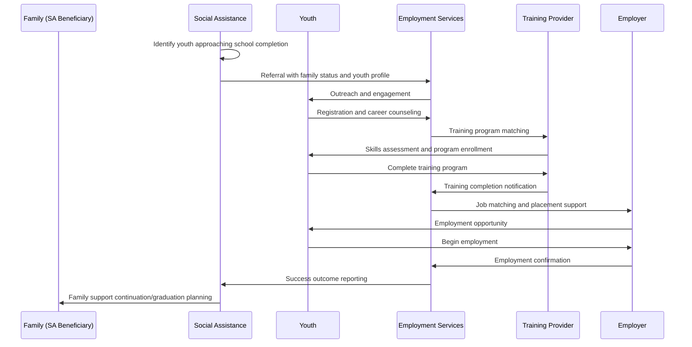

# PRS.EMPL.07 — Youth School-to-Work Transition Process

**Process Standard**: Supporting youth from social assistance families in school-to-work transitions

## Overview

**Objective**: Facilitate successful transitions from education to employment for youth from families receiving social assistance to break cycles of intergenerational poverty.

**Actors**: Social Protection Agency, PES, TVET Institutes, Education System, Youth, Family

**Evidence Base**: Chile (Subsidio al Empleo Joven), Jordan (emerging models), Cambodia (developing approaches)

## Use Case Description

**Primary Scenario**: Youth from families receiving social assistance face additional barriers in transitioning from education to employment. Connecting these young individuals with PES for targeted vocational training programmes and early labour market integration enables proactive engagement with vulnerable youth not in employment, education, or training (NEET).

**Integration Benefits**:
- **For PES**: Early identification and outreach to NEET youth, targeted TVET demand, higher training attendance
- **For SP**: Intergenerational poverty reduction and long-term inclusion
- **For Youth**: Sustained poverty reduction and enhanced long-term social inclusion

## Process Flow



## Preconditions

**System Requirements**:
- Family composition data in social assistance systems
- Youth-focused PES programs and counselors
- TVET integration with employment services
- Employer engagement for youth employment

**Data Requirements**:
- Household composition and youth identification
- Educational background and completion status
- Skills interests and aptitude assessments
- Local youth employment market opportunities

**Legal Framework**:
- Youth employment protection regulations
- Training program eligibility and funding
- Family benefit continuation during youth employment
- Parental consent and youth autonomy balance

## Data Exchange Patterns

### Core Data Objects

**Youth Profile Data** (SA → PES):
```json
{
  "referral_id": "uuid",
  "youth_id": "string",
  "family_context": {
    "household_id": "string",
    "sa_program": "program_identifier",
    "family_size": "number",
    "economic_status": "vulnerability_percentile"
  },
  "youth_details": {
    "age": "16_24_years",
    "education_level": "primary|secondary|incomplete_secondary",
    "current_status": "in_school|completed|dropped_out",
    "interests": ["technical_skills", "service_sector", "trades"],
    "barriers": ["transportation", "childcare", "health", "documentation"]
  },
  "referral_reason": "school_completion|NEET_status|family_request"
}
```

**Training and Employment Tracking** (TVET/PES coordination):
```json
{
  "tracking_id": "uuid",
  "youth_id": "string",
  "services_provided": {
    "career_counseling": "completion_date",
    "skills_assessment": "results_summary",
    "training_enrollment": {
      "program_name": "string",
      "start_date": "date",
      "expected_completion": "date",
      "progress_status": "enrolled|in_progress|completed|dropped_out"
    },
    "job_placement": {
      "employer": "string",
      "position": "string",
      "start_date": "date",
      "employment_type": "formal|informal|apprenticeship"
    }
  },
  "outcome_tracking": {
    "employment_status_6_months": "employed|unemployed|training",
    "retention_12_months": "same_job|different_job|unemployed",
    "income_progression": "baseline_vs_current"
  }
}
```

## Process Variations by Context

### Pre-Graduation Intervention (Age 16-18)
1. **Early Identification** → Youth nearing school completion in SA families
2. **Career Orientation** → Exploration of employment and training options
3. **Transition Planning** → Coordinated planning between school, family, and PES
4. **Training Bridge Programs** → Skills development during final school years

### NEET Youth Engagement (Age 18-24)
1. **Outreach Strategy** → Proactive contact with youth not in education/employment
2. **Barrier Assessment** → Identification of specific obstacles to employment
3. **Intensive Support** → Comprehensive case management and skill development
4. **Employer Engagement** → Targeted job development and placement support

### Family-Integrated Approach (All Ages)
1. **Whole Family Assessment** → Understanding family dynamics and support needs
2. **Coordinated Services** → Integration with family social assistance services
3. **Peer Support** → Connection with other youth in similar circumstances
4. **Long-term Tracking** → Multi-year follow-up on family and youth outcomes

## Integration with Social Protection Systems

### Benefit Coordination Requirements

**Family Benefit Continuity**:
- No penalty to family benefits for youth employment
- Gradual benefit adjustment based on youth income contribution
- Incentives for sustained youth employment and skills development

**Youth-Specific Support**:
- Transportation and training cost assistance
- Childcare support for young parents
- Health services continuation during employment transition

### Case Management Protocol

**Multi-Generational Approach**:
- Joint case planning addressing both family and youth needs
- Coordination between adult and youth-focused services
- Shared goal setting for family economic advancement

**Youth-Centered Services**:
- Age-appropriate counseling and support services
- Peer mentoring and support group access
- Flexible program design accommodating youth schedules and needs

## Key Performance Indicators

### Participation and Engagement
- **Outreach Success**: Percentage of identified youth who engage with PES services
- **Program Completion**: Percentage of youth completing training programs
- **Service Retention**: Average duration of engagement with employment services

### Employment Outcomes
- **Job Placement Rate**: Percentage of youth achieving employment within 6 months
- **Employment Quality**: Percentage in formal employment with benefits
- **Retention Success**: Percentage still employed after 12 months

### Family Impact
- **Family Economic Progress**: Changes in household income and benefit dependency
- **Intergenerational Mobility**: Educational and employment advancement compared to parents
- **Program Satisfaction**: Youth and family satisfaction with integrated services

## Risk Management

### Youth Exploitation Prevention
- **Mitigation**: Strong labor standards enforcement and employer screening
- **Monitoring**: Regular workplace visits and youth welfare checks

### Educational Disruption
- **Mitigation**: Flexible training programs that complement rather than replace education
- **Support**: Academic support services for youth continuing education

### Family Dependency Concerns
- **Mitigation**: Clear benefit policies encouraging rather than penalizing youth employment
- **Communication**: Transparent information about benefit calculations and family impact

## Implementation Requirements

### Specialized Service Delivery
- Youth-focused PES counselors with specialized training
- Age-appropriate facilities and service delivery methods
- Peer support and mentoring program development

### Employer Engagement Strategy
- Youth employment incentive programs
- Employer education about hiring from vulnerable populations
- Job development specifically targeting entry-level opportunities

### Institutional Coordination
- Formal agreements between SA agencies, PES, and education systems
- Shared data systems enabling family-level case management
- Joint performance metrics and accountability frameworks

## Country Implementation Examples

### Chile (Subsidio al Empleo Joven)
- **Scope**: Employment subsidies for youth from low-income families
- **Integration**: RSH social registry identifies eligible youth families
- **Innovation**: Real-time eligibility verification through integrated systems

### Jordan (National Employment Program)
- **Scope**: Youth employment support with family context consideration
- **Integration**: Social assistance and employment services coordination
- **Innovation**: Gender-sensitive programming for young women

### Cambodia (Developing Models)
- **Scope**: TVET integration with family support programs
- **Integration**: ID Poor system and skills development coordination
- **Innovation**: Rural youth employment and migration support

## Data Governance Considerations

### Youth Privacy Protection
- Age-appropriate consent procedures
- Parental involvement balanced with youth autonomy
- Confidential counseling and support services

### Family Data Integration
- Secure linking of individual youth and family records
- Purpose limitation for youth-specific service delivery
- Audit trails for all family data access

### Outcome Measurement
- Long-term tracking with privacy protection
- Anonymized data for program evaluation and improvement
- Transparent reporting on youth and family outcomes

## Special Considerations

### Gender-Responsive Programming
- Recognition of different barriers faced by young women and men
- Flexible programming accommodating care responsibilities
- Gender-specific training and employment opportunities

### Rural and Urban Variations
- Transportation and mobility support for rural youth
- Urban-specific challenges like housing and cost of living
- Local labor market adaptation and opportunity development

### Cultural Sensitivity
- Programming adapted to local cultural norms and expectations
- Family engagement respecting traditional structures
- Community-based support and peer networks

---

**Previous**: [PRS.EMPL.06 — Return to Work](./prs-empl-06-return-to-work.md)
**Next**: [PRS.EMPL.08 — Employer Compliance Monitoring](./prs-empl-08-employer-compliance.md)