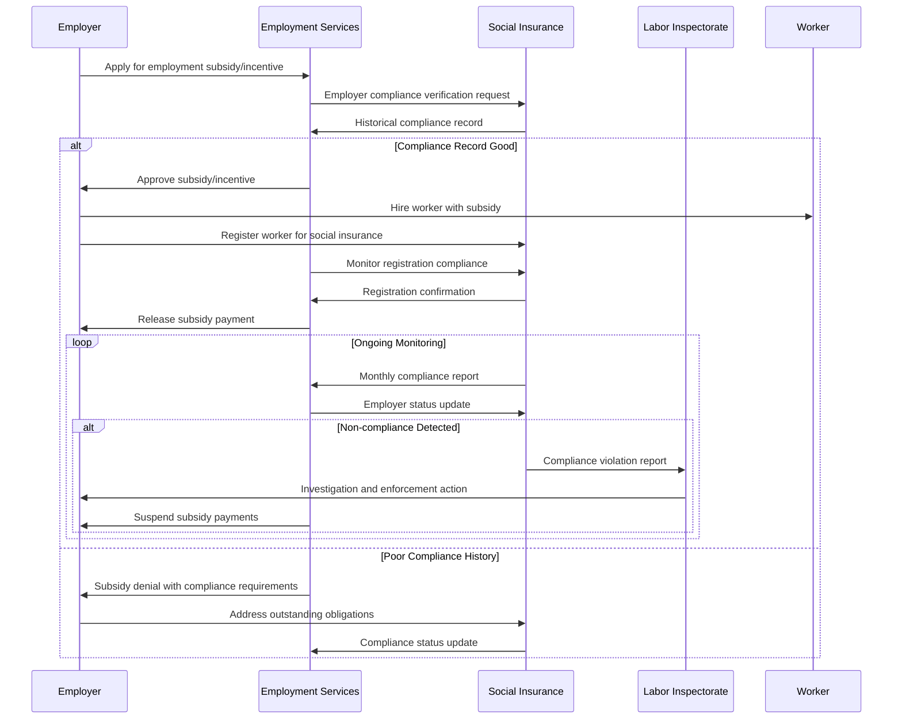

# PRS.EMPL.08 — Employer Compliance Monitoring Process

**Process Standard**: Monitoring employer compliance with social insurance obligations in employment subsidy programs

## Overview

**Objective**: Ensure employers receiving employment incentives comply with social insurance obligations and worker protection requirements through coordinated monitoring between PES and Social Insurance systems.

**Actors**: PES, Social Insurance Agency, Labor Inspectorate, Employer, Worker

**Evidence Base**: Uruguay (employment subsidy monitoring), European countries (integrated compliance systems)

## Use Case Description

**Primary Scenario**: Employers receiving employment subsidies, wage incentives, or other benefits from PES must comply with legal obligations including proper worker registration with social insurance schemes. Cross-system monitoring ensures employers fulfill responsibilities while protecting worker entitlements.

**Integration Benefits**:
- **For PES**: Enhanced employer accountability and program integrity
- **For SP**: Improved contribution collection and worker protection
- **For Workers**: Ensured access to social protection benefits and legal employment

## 🔄 **Process Flow Design (DCI Pattern)**



## Preconditions

**System Requirements**:
- Integrated employer registration across PES and SI systems
- Real-time social insurance contribution monitoring
- Employment subsidy tracking and payment systems
- Labor inspection coordination capabilities

**Data Requirements**:
- Employer compliance history and current status
- Worker registration and contribution records
- Employment subsidy program participation
- Labor standards and inspection records

**Legal Framework**:
- Employment subsidy program regulations
- Social insurance contribution requirements
- Labor inspection authority and procedures
- Employer sanctions and penalty framework

## Data Exchange Patterns

### Core Data Objects

**Employer Compliance Profile** (SI → PES):
```json
{
  "employer_id": "string",
  "business_registration": "string",
  "compliance_status": {
    "overall_rating": "compliant|warning|non_compliant",
    "social_insurance": {
      "registration_compliance": "percentage",
      "contribution_payment": "current|behind_1_month|behind_3_months|defaulted",
      "worker_registration_rate": "percentage",
      "outstanding_obligations": "amount_in_currency"
    },
    "labor_standards": {
      "inspection_history": "inspection_count_last_2_years",
      "violations_found": ["wage_violations", "safety_violations", "registration_violations"],
      "remediation_status": "completed|in_progress|not_started"
    }
  },
  "risk_assessment": "low|medium|high",
  "monitoring_frequency": "monthly|quarterly|annual"
}
```

**Subsidy Compliance Monitoring** (PES coordination):
```json
{
  "subsidy_id": "uuid",
  "employer_id": "string",
  "program_type": "employment_subsidy|wage_incentive|training_support",
  "workers_covered": [
    {
      "worker_id": "string",
      "hire_date": "date",
      "subsidy_amount": "currency",
      "si_registration_status": "registered|pending|not_registered",
      "contribution_status": "current|overdue|missing"
    }
  ],
  "compliance_monitoring": {
    "last_check_date": "date",
    "compliance_score": "percentage",
    "violations_detected": ["unregistered_workers", "missing_contributions", "false_reporting"],
    "corrective_actions": "required_actions_list",
    "payment_status": "released|suspended|clawed_back"
  }
}
```

## Process Variations by Context

### Pre-Approval Screening
1. **Application Review** → Employer subsidy application assessment
2. **Compliance Check** → Historical compliance record verification
3. **Risk Assessment** → Determine monitoring requirements and conditions
4. **Conditional Approval** → Subsidy approval with compliance conditions

### Ongoing Monitoring (Active Subsidies)
1. **Regular Compliance Checks** → Automated verification of worker registration
2. **Payment Verification** → Confirmation of social insurance contributions
3. **Cross-Referencing** → Validation against labor inspection records
4. **Performance Assessment** → Overall compliance scoring and risk rating

### Violation Response
1. **Issue Identification** → Detection of compliance violations
2. **Investigation Coordination** → Joint PES-SI-Labor Inspectorate review
3. **Enforcement Action** → Suspension of subsidies and corrective requirements
4. **Remediation Monitoring** → Verification of compliance restoration

## Integration with Social Protection Systems

### Data Sharing Requirements

**Real-Time Integration**:
- Worker registration status in social insurance systems
- Contribution payment tracking and arrears identification
- Employment subsidy payment status and conditions

**Cross-System Validation**:
- Employer registration consistency across agencies
- Worker employment status verification
- Benefit payment coordination and prevention of double payments

### Enforcement Coordination

**Multi-Agency Response**:
- Joint investigations for serious violations
- Coordinated sanctions and penalty enforcement
- Shared blacklisting and restriction databases

**Worker Protection**:
- Immediate notification to affected workers
- Alternative employment placement for displaced workers
- Social insurance benefit protection during transitions

## Key Performance Indicators

### Compliance Monitoring Effectiveness
- **Detection Rate**: Percentage of violations identified through automated monitoring
- **Response Time**: Average time from violation detection to enforcement action
- **Employer Compliance Rate**: Percentage of subsidized employers maintaining full compliance

### Program Integrity
- **Subsidy Recovery**: Amount recovered from non-compliant employers
- **Prevented Violations**: Estimated violations prevented through monitoring presence
- **Worker Protection**: Percentage of workers maintaining social insurance coverage

### System Integration
- **Data Accuracy**: Percentage of employer records with consistent information across systems
- **Automated Processing**: Percentage of compliance checks performed automatically
- **Cross-Agency Coordination**: Success rate of joint enforcement actions

## Risk Management

### Employer Circumvention
- **Mitigation**: Sophisticated detection algorithms and cross-system validation
- **Response**: Enhanced monitoring for employers with violation history

### Administrative Burden
- **Mitigation**: Automated compliance checking and streamlined reporting requirements
- **Balance**: Risk-based monitoring focusing resources on high-risk employers

### Worker Vulnerability
- **Mitigation**: Worker protection during enforcement actions
- **Support**: Alternative employment services for affected workers

## Implementation Requirements

### Technical Infrastructure
- Integrated employer database across PES and SI systems
- Real-time contribution monitoring and alert systems
- Automated compliance scoring and risk assessment tools

### Institutional Coordination
- Formal agreements between PES, SI, and Labor Inspectorate
- Joint training programs for compliance monitoring staff
- Shared enforcement protocols and escalation procedures

### Legal Framework
- Clear authority for cross-system data sharing and monitoring
- Standardized sanctions and penalty framework
- Appeal and due process procedures for employers

## Country Implementation Examples

### Uruguay
- **Scope**: Employment subsidy programs with integrated compliance monitoring
- **Integration**: PES and social insurance coordination for employer oversight
- **Innovation**: Risk-based monitoring with automated compliance scoring

### European Union Models
- **Scope**: State aid compliance monitoring across employment programs
- **Integration**: Multi-agency coordination for subsidy oversight
- **Innovation**: Digital monitoring systems with real-time compliance tracking

## Data Governance Considerations

### Employer Privacy
- Business information protection with legitimate oversight purposes
- Appeal processes for compliance determinations
- Transparent criteria and assessment methodology

### Data Quality Assurance
- Regular validation of employer information across systems
- Automated error detection and correction procedures
- Quality metrics for compliance data accuracy

### Audit and Accountability
- Regular audit of monitoring effectiveness and fairness
- Public reporting on program integrity and compliance rates
- Independent review of enforcement decisions and appeals

## Special Considerations

### Small Business Accommodation
- Proportionate monitoring based on business size and complexity
- Technical assistance for compliance rather than purely punitive approach
- Simplified reporting requirements for micro-enterprises

### Informal Sector Transition
- Support for informal businesses transitioning to formal compliance
- Graduated compliance requirements with improvement timelines
- Incentives for voluntary compliance and worker formalization

### Cross-Border Employment
- Coordination with international social security agreements
- Compliance monitoring for workers employed across jurisdictions
- Data sharing protocols for multinational employers

## Performance Enhancement Strategies

### Preventive Approach
- Pre-subsidy compliance training and support for employers
- Clear guidance and resources for social insurance obligations
- Regular communication about compliance requirements and changes

### Technology Enhancement
- Machine learning algorithms for fraud detection and risk assessment
- Mobile applications for real-time compliance reporting
- Blockchain or distributed ledger technology for transparent compliance records

### Stakeholder Engagement
- Employer associations partnership for compliance promotion
- Worker organization involvement in monitoring and reporting
- Civil society participation in oversight and accountability

---

**Previous**: [PRS.EMPL.07 — Youth School-to-Work Transition](./prs-empl-07-youth-transition.md)
**Next**: [PRS.EMPL.09 — PES Client Social Assistance Access](./prs-empl-09-pes-client-sa-access.md)