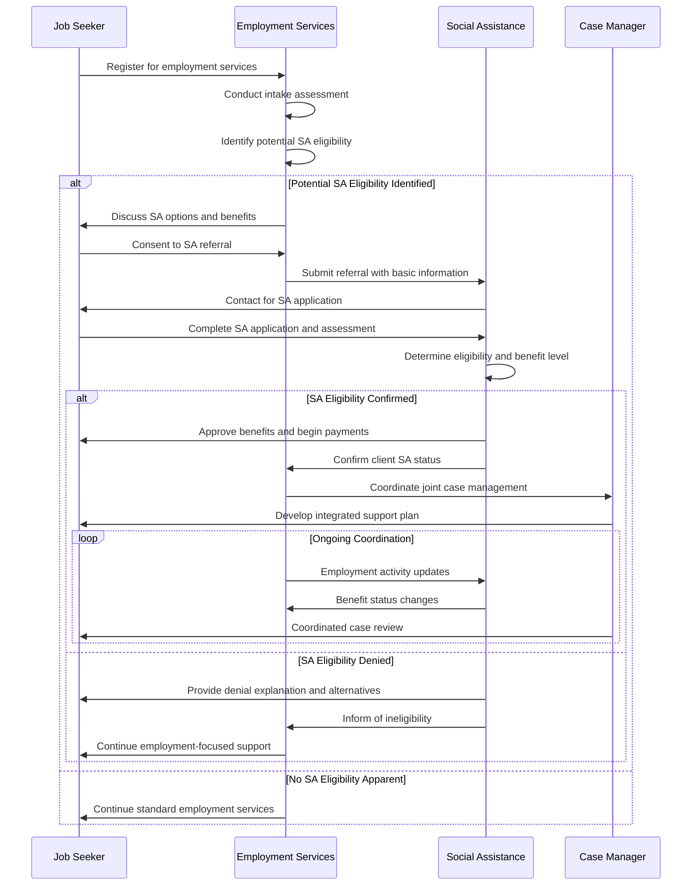

# PRS.EMPL.09 — PES Client Social Assistance Access Process

**Process Standard**: Supporting PES clients to access Social Assistance when eligible

## Overview

**Objective**: Enable PES to identify and refer unemployed individuals and job seekers to appropriate Social Assistance programs when they meet eligibility criteria, ensuring comprehensive support during employment transitions.

**Actors**: PES, Social Assistance Agency, Job Seeker, Case Manager

**Evidence Base**: Identified in ILO touch point analysis as "SA3: Support PES clients to access SA"

## Use Case Description

**Primary Scenario**: Job seekers registered with PES may face economic hardship and qualify for Social Assistance programs. Effective coordination enables PES counselors to identify eligibility and facilitate access to income support, ensuring individuals can meet basic needs while engaging in job search and training activities.

**Integration Benefits**:
- **For PES**: Enhanced client support and improved program retention
- **For SA**: Better targeting and outreach to eligible populations
- **For Job Seekers**: Comprehensive support addressing both employment and immediate economic needs

## 🔄 **Process Flow Design (DCI Pattern)**



## Preconditions

**System Requirements**:
- PES intake assessment capabilities including economic status screening
- SA eligibility determination systems and criteria
- Secure referral and communication channels between agencies
- Coordinated case management capabilities

**Data Requirements**:
- Job seeker demographic and economic information
- SA program eligibility criteria and application processes
- Employment service participation and progress data
- Benefit status and payment information

**Legal Framework**:
- Authority for PES to make SA referrals
- Data sharing agreements for client information
- Coordination protocols between employment and assistance agencies
- Client consent and privacy protection requirements

## Data Exchange Patterns

### Core Data Objects

**PES Client Profile** (PES → SA):
```json
{
  "referral_id": "uuid",
  "client_id": "string",
  "referral_date": "date",
  "basic_demographics": {
    "age": "number",
    "household_size": "number",
    "dependents": "number",
    "address": "geographic_location"
  },
  "economic_status": {
    "employment_status": "unemployed|underemployed",
    "unemployment_duration": "months",
    "income_sources": ["unemployment_benefits", "part_time_work", "other_support"],
    "estimated_monthly_income": "currency_amount"
  },
  "employment_services": {
    "registration_date": "date",
    "services_received": ["job_counseling", "training", "job_search_support"],
    "employment_goals": "employment_type_and_timeline",
    "barriers_identified": ["transportation", "childcare", "skills", "health"]
  },
  "referral_reason": "economic_hardship|specific_program_eligibility|client_request"
}
```

**Coordinated Case Status** (SA ↔ PES):
```json
{
  "coordination_id": "uuid",
  "client_id": "string",
  "case_status": {
    "sa_benefit_status": "approved|pending|denied|terminated",
    "benefit_amount": "currency_per_month",
    "benefit_duration": "months_or_indefinite",
    "employment_status": "active_job_search|training|employed|inactive"
  },
  "coordination_plan": {
    "joint_case_manager": "assigned_staff_member",
    "coordinated_goals": ["benefit_stability", "employment_placement", "skills_development"],
    "service_coordination": "shared_appointments|parallel_services|integrated_planning",
    "review_schedule": "frequency_and_next_review_date"
  },
  "progress_tracking": {
    "employment_activities": "job_applications_training_participation",
    "benefit_compliance": "reporting_requirements_met",
    "goal_achievement": "progress_toward_employment_and_stability"
  }
}
```

## Process Variations by Context

### Emergency Economic Support
1. **Immediate Needs Assessment** → Rapid identification of crisis situations
2. **Expedited Referral** → Fast-track SA application for urgent cases
3. **Bridge Support** → Temporary assistance while SA application processes
4. **Crisis Case Management** → Intensive coordination during emergency periods

### Transitional Support (Employment to Unemployment)
1. **Job Loss Notification** → Employer or client notification of employment termination
2. **Benefit Transition Planning** → Coordination between unemployment insurance and SA
3. **Continued Employment Support** → Maintaining PES engagement during benefit transition
4. **Return to Work Preparation** → Planning for benefit reduction as employment resumes

### Comprehensive Family Support
1. **Household Assessment** → Understanding family composition and needs
2. **Multi-Program Eligibility** → Assessment for various SA programs (housing, food, childcare)
3. **Family Case Management** → Coordinated support addressing employment and family needs
4. **Child and Dependent Support** → Specific services for families with children or dependents

## Integration with Social Protection Systems

### Benefit Coordination Requirements

**Income Assessment**:
- Accurate accounting of employment income and SA benefits
- Coordination to prevent benefit overpayment or gaps
- Clear understanding of earning disregards and work incentives

**Program Coordination**:
- Integration with multiple SA programs (housing, food assistance, healthcare)
- Coordination with unemployment insurance where applicable
- Alignment of employment activation requirements across programs

### Case Management Protocol

**Shared Service Planning**:
- Joint assessment of client needs and goals
- Coordinated service delivery avoiding duplication
- Regular communication between PES and SA case managers

**Client-Centered Approach**:
- Single point of contact when possible
- Consistent messaging about program requirements and opportunities
- Streamlined reporting and compliance requirements

## Key Performance Indicators

### Access and Outreach
- **Referral Rate**: Percentage of eligible PES clients referred to SA programs
- **Application Success**: Percentage of referred clients approved for SA benefits
- **Time to Access**: Average time from PES referral to SA benefit receipt

### Service Coordination
- **Joint Case Management**: Percentage of clients with coordinated service plans
- **Communication Frequency**: Regular information sharing between agencies
- **Service Integration**: Reduction in duplicated services and assessments

### Client Outcomes
- **Economic Stability**: Improvement in client economic situation with combined support
- **Employment Progression**: Employment outcomes for clients receiving both PES and SA services
- **Program Satisfaction**: Client satisfaction with coordinated services

## Risk Management

### Eligibility Errors
- **Mitigation**: Clear eligibility screening tools and training for PES staff
- **Quality Control**: Regular review of referral accuracy and outcomes

### Privacy and Confidentiality
- **Mitigation**: Strict consent procedures and limited data sharing protocols
- **Protection**: Secure communication channels and access controls

### Resource Strain
- **Mitigation**: Capacity planning and resource allocation coordination
- **Efficiency**: Streamlined processes reducing administrative burden

## Implementation Requirements

### Staff Training and Development
- PES staff training on SA program eligibility and application processes
- SA staff understanding of employment services and coordination requirements
- Joint training programs for case managers from both agencies

### System Integration
- Shared client management systems or secure data exchange protocols
- Common assessment tools and eligibility screening capabilities
- Integrated reporting and performance monitoring systems

### Policy Coordination
- Aligned program rules and requirements where possible
- Clear protocols for handling conflicting program requirements
- Streamlined appeals and grievance procedures

## Country Implementation Examples

### Coordinated Service Models
- **One-Stop Centers**: Physical co-location of PES and SA services
- **Integrated Case Management**: Joint case managers serving clients across programs
- **Digital Integration**: Online portals providing access to both employment and assistance services

### Legal and Regulatory Frameworks
- **Statutory Coordination Requirements**: Legal mandates for agency coordination
- **Data Sharing Agreements**: Formal protocols enabling information exchange
- **Client Rights Protection**: Clear procedures protecting client privacy and choice

## Data Governance Considerations

### Client Consent Management
- Explicit consent for cross-agency information sharing
- Clear explanation of benefits and risks of coordination
- Right to opt-out of coordination while maintaining access to individual services

### Data Quality and Accuracy
- Regular validation of client information across systems
- Error correction procedures and quality assurance protocols
- Performance metrics for data accuracy and completeness

### Privacy Protection
- Purpose limitation for shared client information
- Access controls ensuring only authorized staff access client data
- Regular audit of data sharing practices and compliance

## Special Considerations

### Vulnerable Population Support
- Enhanced coordination for clients with disabilities, mental health issues, or substance use disorders
- Specialized case management for domestic violence survivors and other vulnerable groups
- Cultural and linguistic competency in service delivery

### Rural and Remote Areas
- Alternative service delivery methods for areas with limited physical access
- Technology solutions enabling coordination across distance
- Mobile service delivery and outreach programs

### Economic Crisis Response
- Surge capacity planning for economic downturns or emergencies
- Expedited processes for mass layoffs or community economic disruption
- Coordination with emergency assistance and disaster relief programs

---

**Previous**: [PRS.EMPL.08 — Employer Compliance Monitoring](./prs-empl-08-employer-compliance.md)
**Next**: [Implementation Operational Guidance](../../../implementation/operational-guidance.md)