# Employment-SP Process Standards: Workflows

This document provides detailed workflow diagrams for the core Employment-Social Protection interoperability processes, including BPMN process flows and sequence diagrams for system interactions.

## Overview

The workflows illustrate the step-by-step processes, decision points, and system interactions for each of the five core employment use cases defined in `use-cases.md`. These diagrams support implementation planning and system integration design.

---

## PRS.EMPL.01  Beneficiary Referral to PES

### BPMN Process Flow

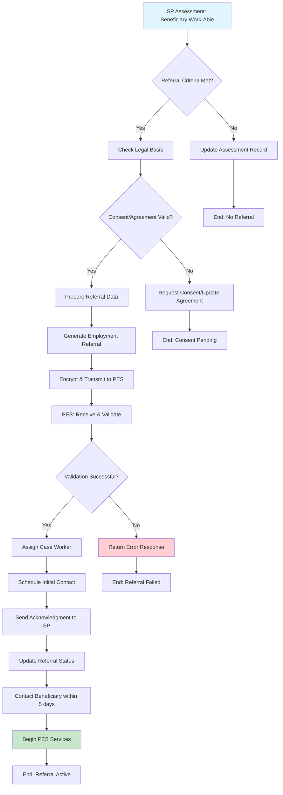

### Sequence Diagram

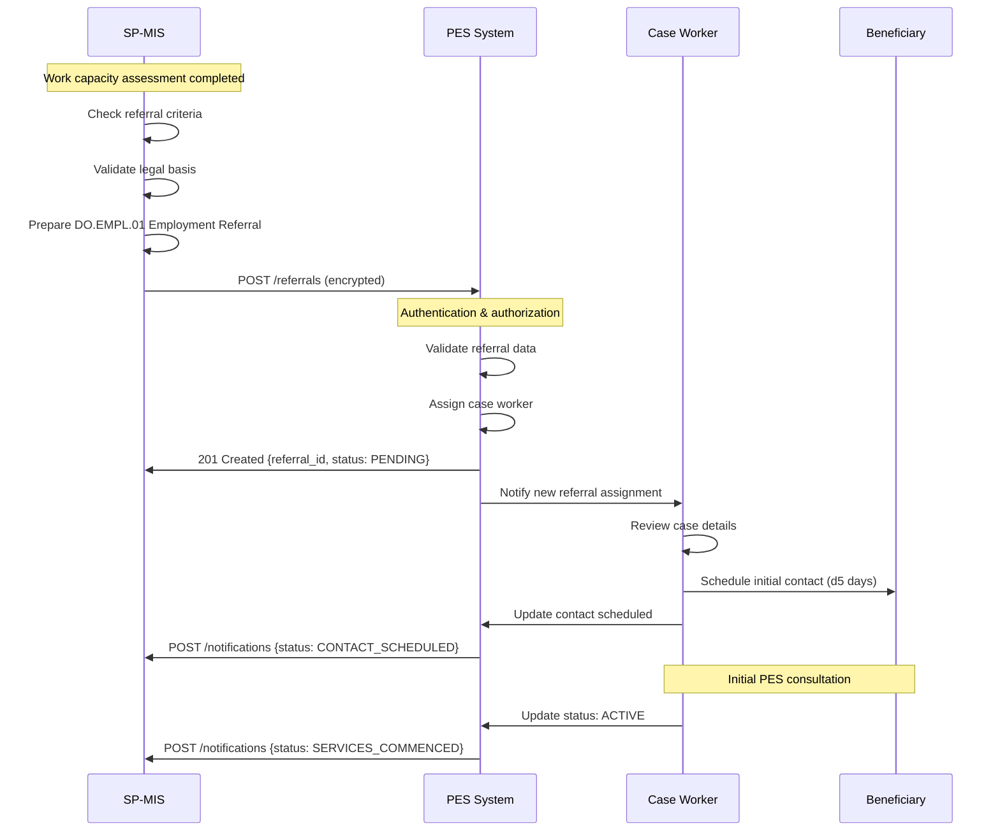

---

## PRS.EMPL.02  Employment Status Verification

### BPMN Process Flow

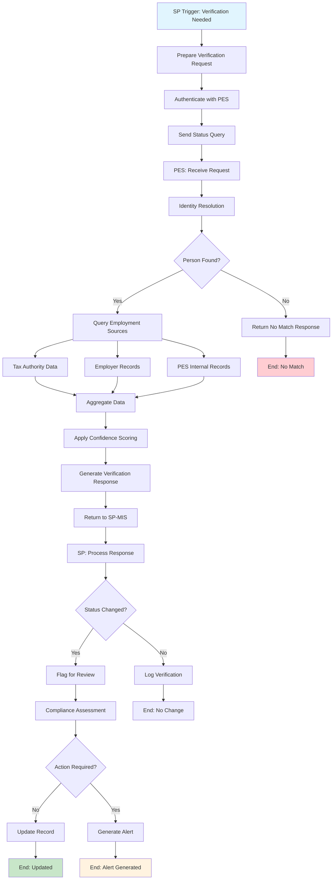

### Sequence Diagram

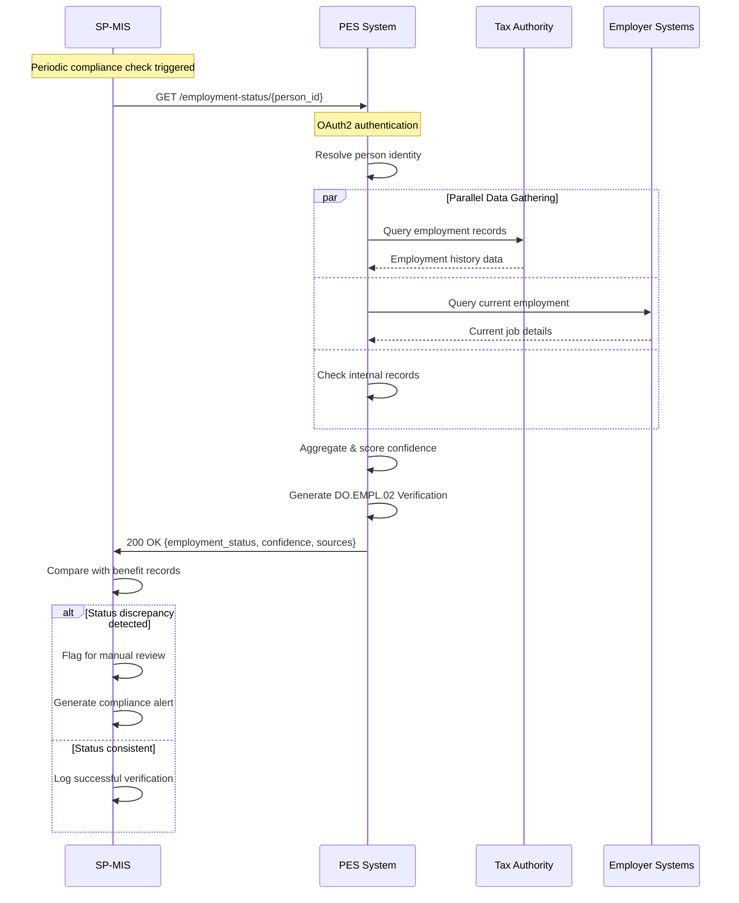

---

## PRS.EMPL.03  Training Benefit Enrollment

### BPMN Process Flow

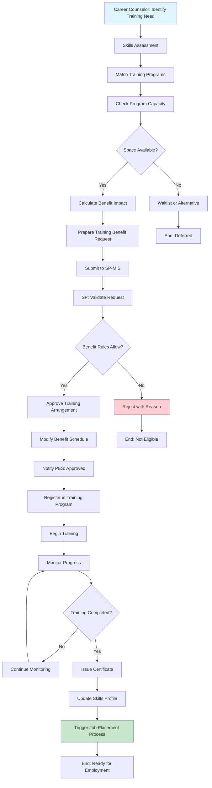

### Sequence Diagram

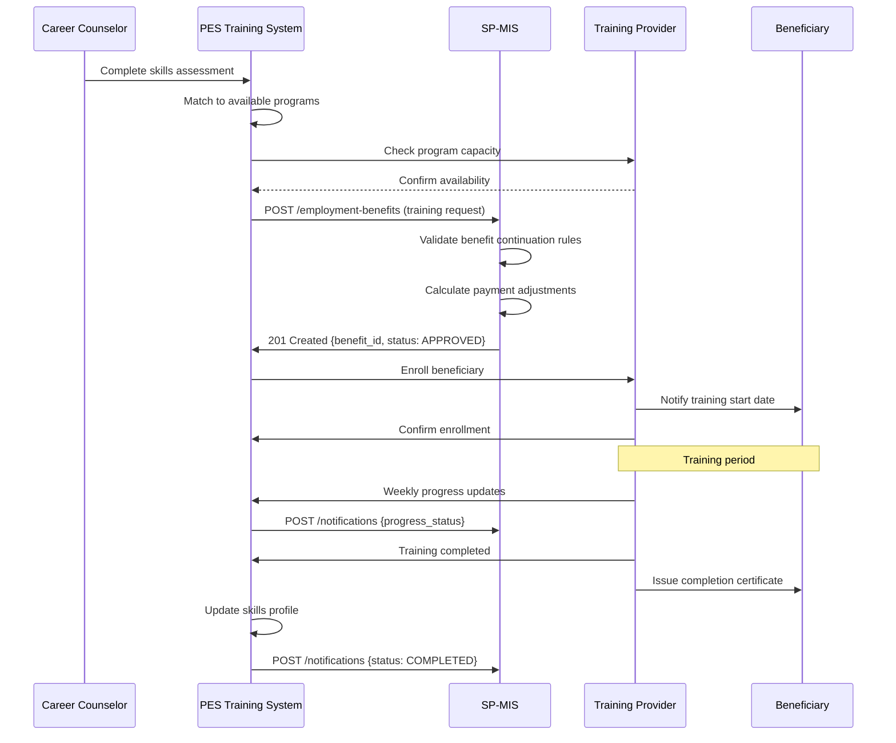

---

## PRS.EMPL.04  Job Placement Tracking

### BPMN Process Flow

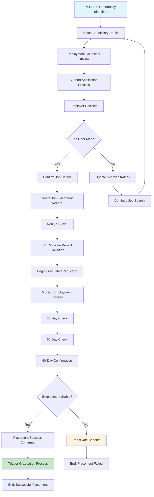

### Sequence Diagram

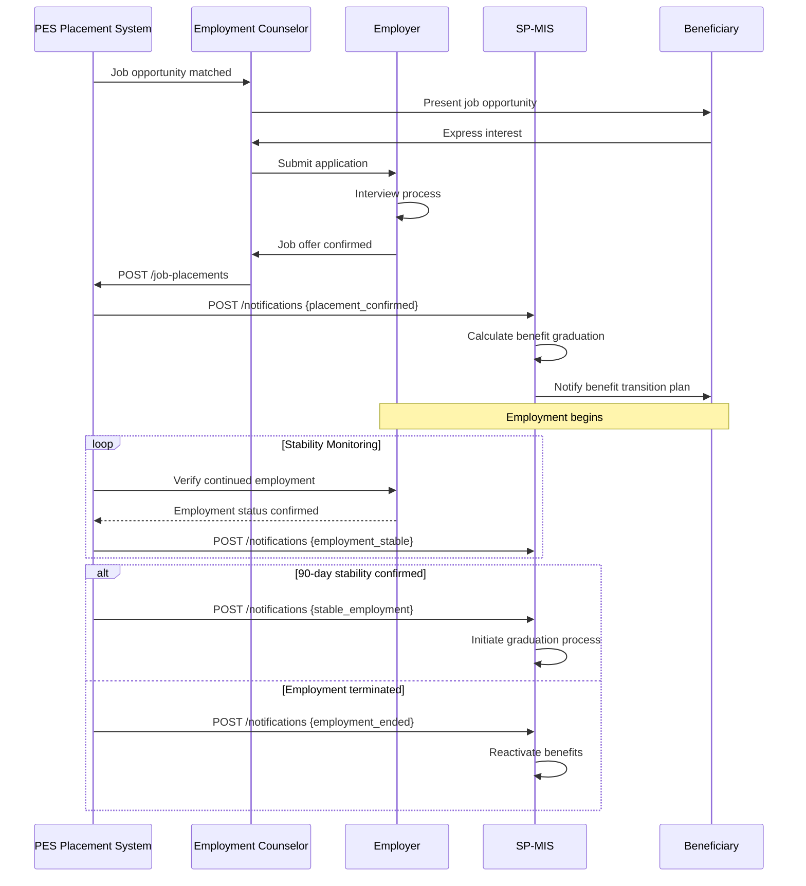

---

## PRS.EMPL.05  Benefit Graduation Process

### BPMN Process Flow

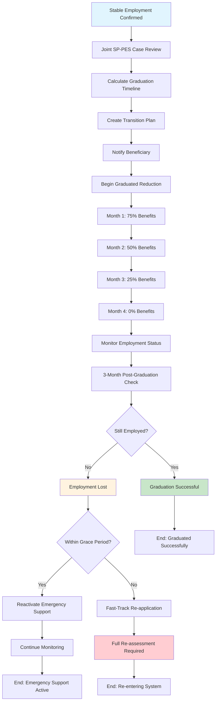

### Sequence Diagram

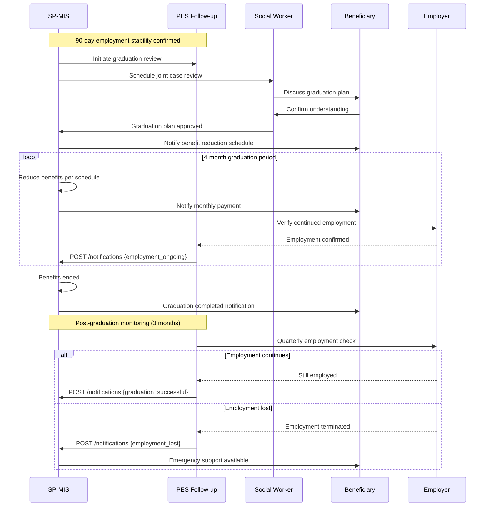

---

## Cross-Process Workflow Integration

### Master Process Flow

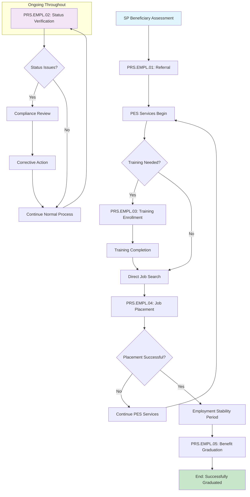

### Data Flow Architecture

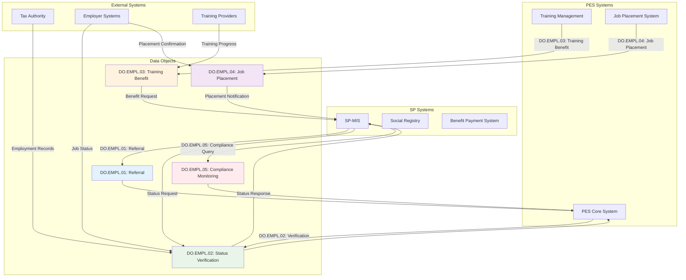

---

## DCI Ecosystem Integration Workflows

### Cross-Interface Coordination Flow

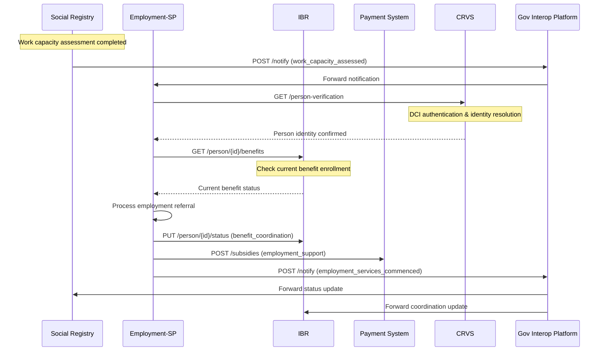

### DCI Authentication Flow

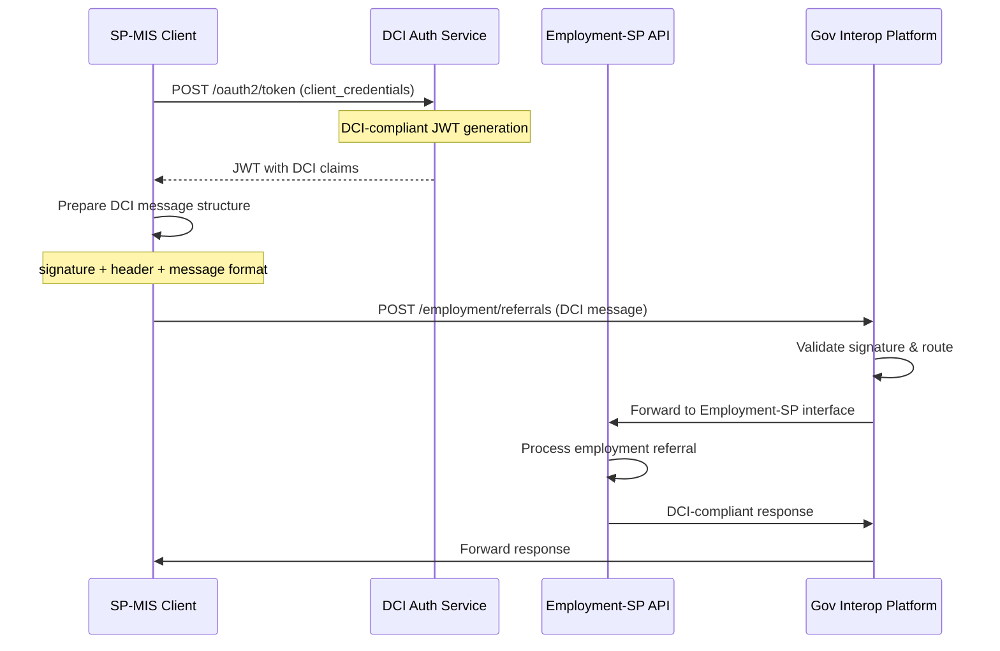

### Government Interoperability Platform Integration

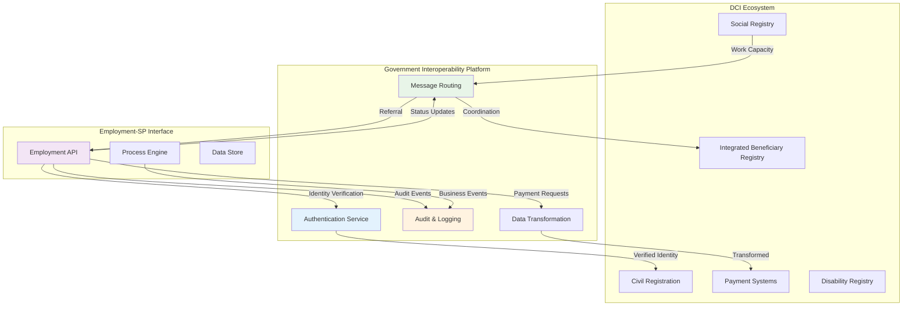

---

## Implementation Considerations

### Performance Requirements
- **Referral Processing**: <5 seconds end-to-end
- **Status Verification**: <2 seconds response time
- **Batch Operations**: Support for 1000+ records/hour
- **Concurrent Users**: 100+ simultaneous system connections

### Error Handling Patterns
- **Retry Logic**: Exponential backoff for temporary failures
- **Circuit Breaker**: Prevent cascade failures during outages
- **Dead Letter Queue**: Handle unprocessable messages
- **Compensation Transactions**: Rollback for partial failures

### Security Considerations
- **End-to-End Encryption**: All sensitive data in transit
- **Audit Logging**: Complete activity trail for compliance
- **Access Control**: Role-based permissions at API level
- **Data Minimization**: Only necessary data in each exchange

### Monitoring and Alerting
- **SLA Monitoring**: Track response times and availability
- **Business Metrics**: Placement rates, graduation success
- **Error Rate Tracking**: Identify system integration issues
- **Compliance Reporting**: Regular audit and performance reports

---

### DCI Integration Requirements
- **Cross-Interface Coordination**: All workflows validated against DCI ecosystem patterns
- **Message Structure Compliance**: Signature + header + message format verified for all API calls
- **Identity Resolution**: Person identification consistent across all DCI interfaces
- **Government Platform Integration**: Workflows tested with both direct and platform-mediated patterns

---

## Quality Assurance Checklist

### DCI Compliance Validation
- [ ] All workflows include DCI-standard authentication patterns
- [ ] Cross-interface coordination properly sequenced
- [ ] JSON-LD message structures validated against DCI schemas
- [ ] Event-driven notifications aligned with DCI ecosystem requirements

### Performance & SLA Requirements
- [ ] Cross-interface response times: < 5 seconds end-to-end
- [ ] DCI message routing latency: < 1 second platform overhead
- [ ] Government Interoperability Platform integration tested
- [ ] Fallback patterns validated for platform unavailability

### Security & Audit Compliance
- [ ] End-to-end encryption for all cross-interface data exchange
- [ ] DCI-compliant audit logging for all transactions
- [ ] Cross-border data transfer compliance where applicable
- [ ] Role-based access control consistent across DCI ecosystem

---

## Open Issues

`TODO(technical)`: Validate sequence diagrams with actual DCI API specifications from dci-standards repository
`TODO(performance)`: Define specific SLA requirements for Government Interoperability Platform integration
`TODO(security)`: Detail DCI-compliant encryption and digital signature requirements
`TODO(governance)`: Align workflow error handling with DCI ecosystem resilience patterns