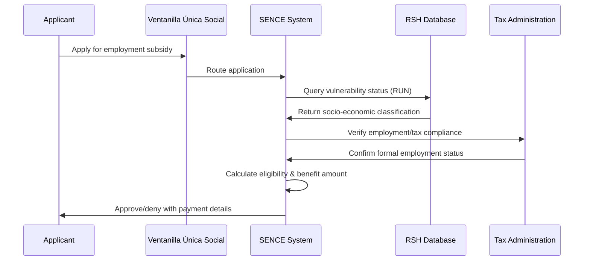
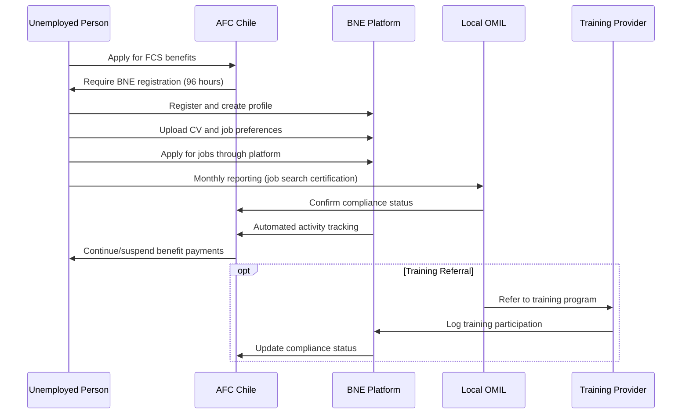

# Chile: RSH-OMIL Integration Case Study

## Executive Summary

Chile demonstrates mature Employment-SP interoperability through two primary integration patterns that link social protection systems with employment services. The **RSH-SENCE integration** enables targeted employment subsidies for vulnerable populations, while the **BNE-AFC integration** enforces conditionality linking unemployment benefits to active job search. Both patterns demonstrate successful real-time data exchange, strong legal frameworks, and effective governance coordination.

**Key Systems**:
- **RSH**: Social Registry (Registro Social de Hogares) - vulnerability assessment
- **SENCE**: National Training and Employment Service - employment subsidies
- **BNE**: National Employment Portal (Bolsa Nacional de Empleo) - job matching
- **AFC**: Unemployment Insurance administrator
- **OMIL**: Municipal Labour Information Offices - local service delivery

## Use Case A: RSH-SENCE Employment Subsidies Integration

### System Overview

The RSH-SENCE integration enables Chile to deliver employment subsidies (SEJ and SMT) to the most vulnerable workers by leveraging the Social Registry's household vulnerability assessments. This integration demonstrates effective targeting of employment programs using social protection data.

### Actors and Systems

**Primary Systems**:
- **Registro Social de Hogares (RSH)**: Chile's official social registry managed by Ministry of Social Development and Family (MDSF)
- **SENCE**: National Training and Employment Service administering employment subsidies
- **Ventanilla Única Social (VUS)**: Central digital portal for social protection access

**Supporting Systems**:
- **SII**: Tax administration (Servicio de Impuestos Internos)
- **Social Security databases**: Pension and health contribution verification
- **Chile's Interoperability Platform**: Government-to-government data exchange backbone

### Employment Subsidies Programs

**Subsidio al Empleo Joven (SEJ) - Youth Employment Subsidy**:
- **Target Group**: Workers aged 18-24 from vulnerable households
- **Benefit**: ~30% of gross wages (subject to income caps)
- **Eligibility**: Formal employment + RSH vulnerability classification (bottom 40%)
- **2024 Impact**: 299,193 workers benefited

**Subsidio al Empleo de la Mujer Trabajadora (SMT) - Women's Employment Subsidy**:
- **Target Group**: Women aged 25-59 from vulnerable households
- **Benefit**: ~30% of gross wages (subject to income caps)
- **Duration**: Up to 48 months per beneficiary
- **2024 Impact**: 395,052 women benefited

### Data Flow Process



**Step-by-Step Process**:
1. **Application Submission**: Individual applies via SENCE website, VUS portal, or ChileAtiende offices
2. **Identity Verification**: SENCE validates applicant using national ID (RUN)
3. **Vulnerability Query**: Real-time API call to RSH using RUN identifier
4. **Classification Response**: RSH returns socio-economic percentile and household status
5. **Employment Verification**: Cross-check with tax administration and social security databases
6. **Eligibility Determination**: SENCE combines RSH + employment data to determine qualification
7. **Benefit Calculation**: System calculates subsidy amount based on wages and program rules
8. **Payment Processing**: Monthly or annual payments to worker and employer (if applicable)

### Data Objects Exchanged

**Core Data Elements**:
- **Person Identifier**: National ID (RUN) for cross-system lookup
- **Household Vulnerability Score**: RSH socio-economic classification percentile
- **Employment Status**: Formal employment verification with contribution compliance
- **Income Data**: Gross wages for benefit calculation (capped at CLP $662,348/month)
- **Employer Information**: Company identification for dual subsidy processing

**Data Minimization Approach**:
- RSH shares only **vulnerability percentile** (not detailed household composition)
- **Purpose limitation**: Data access restricted to employment subsidy eligibility
- **Retention limits**: Data used only for active benefit periods

### Legal Framework

**Primary Legislation**:
- **Law Nº 20.338 (2009)**: Establishes Youth Employment Subsidy (SEJ)
- **Law Nº 20.595 (2012)**: Creates Women's Employment Subsidy (SMT)
- **Law Nº 20.379 (2009)**: Creates RSH as official social registry for program targeting

**Data Protection Framework**:
- **Law Nº 19.628 (1999)**: Personal data protection (updated by Law Nº 21.719 in 2024)
- **Data minimization principle**: Only information strictly necessary for program operation
- **Inter-institutional agreements**: Formal contracts authorize SENCE access to specific RSH fields

**Governance Requirements**:
- **Subsecretaría de Evaluación Social (MDSF)**: Must authorize all RSH data sharing agreements
- **Audit obligations**: All data requests and transfers must be logged and traceable
- **Confidentiality clauses**: Agreements include access restrictions and security provisions

### Technical Implementation

**Interoperability Architecture**:
- **Platform**: Chile's Plataforma de Interoperabilidad del Estado (government interoperability backbone)
- **Integration Mode**: Real-time API queries at application submission
- **Protocol**: Secure web service APIs with encryption and authentication
- **Response Time**: Immediate eligibility confirmation during application process

**Security Measures**:
- **Encryption**: All data exchanges encrypted in transit
- **Authentication**: System-to-system authentication via government PKI
- **Audit Logging**: Every query logged in interoperability platform registry
- **Access Control**: Role-based permissions for authorized SENCE staff

**API Operation Example**:
```json
{
  "request": {
    "system_id": "SENCE",
    "query_type": "vulnerability_check",
    "person_id": "12345678-9",
    "program_code": "SEJ_2024"
  },
  "response": {
    "vulnerability_percentile": 25,
    "eligible": true,
    "household_id": "HH_789456",
    "classification_date": "2024-09-15"
  }
}
```

## Use Case B: BNE-AFC Unemployment Insurance Integration

### System Overview

The BNE-AFC integration enforces conditionality requirements for Chile's Solidarity Unemployment Fund (FCS) by tracking job search activities and training participation. This demonstrates active labor market policy implementation through digital monitoring.

### Actors and Systems

**Primary Systems**:
- **Bolsa Nacional de Empleo (BNE)**: National online employment exchange managed by Ministry of Labour
- **AFC Chile**: Unemployment insurance fund administrator
- **OMIL**: Municipal Labour Information Offices (network of 334 offices nationwide)

**Supporting Systems**:
- **SENCE**: Training program provider
- **ChileValora**: Skills certification services
- **Superintendencia de Pensiones**: Regulatory oversight body

### Conditionality Framework

**FCS Eligibility Requirements**:
- **Contribution History**: Minimum 10 contributions in past 24 months
- **Involuntary Unemployment**: Job loss due to contract expiration or business needs
- **Work Capacity**: Able and available for work

**Activation Obligations**:
- **BNE Registration**: Must register within 96 hours of benefit application
- **Monthly OMIL Reporting**: In-person certification of job search activities
- **Active Job Search**: CV maintenance, job applications, interview attendance
- **Training Participation**: Accept suitable training referrals from SENCE

### Job Search Monitoring Process



**Monthly Compliance Cycle**:
1. **Job Search Activities**: Apply for jobs, attend interviews, update CV
2. **Platform Tracking**: BNE automatically logs applications and profile updates
3. **OMIL Reporting**: Monthly in-person visit to certify additional activities
4. **Compliance Assessment**: AFC reviews BNE data + OMIL certification
5. **Benefit Decision**: Continue payments if compliant, suspend if non-compliant
6. **Training Integration**: SENCE courses count toward compliance requirements

### Data Objects Tracked

**Job Search Activities**:
- **Job Applications**: Positions applied for through BNE platform
- **Profile Maintenance**: CV updates, skills assessments, availability status
- **Interview Attendance**: Self-reported with verification requirements
- **Training Participation**: SENCE course enrollment and completion

**Compliance Monitoring**:
- **Monthly Certification**: OMIL-verified job search efforts
- **Platform Activity**: Login frequency, search behaviors, application patterns
- **Non-compliance Events**: Missed appointments, rejected suitable offers
- **Sanction History**: Benefit suspensions and reinstatement records

**BNE Data Fields** (from system documentation):
- Personal identification and contact information
- Educational background and work experience
- Job preferences and availability
- Application history and interview records
- Training course participation
- Skills assessments and certifications

### Legal Framework

**Statutory Basis**:
- **Law Nº 19.728**: Mandatory unemployment insurance establishing conditionality framework
- **Article 25**: Authorizes FCS resources for training and employability programs
- **Article 28**: Requires demonstrated job search; BNE registration mandatory for compliance

**Implementation Regulations**:
- **Supreme Decree Nº 46/2015**: Detailed implementing regulations for conditionality
- **Superintendencia de Pensiones Compendio**: Consolidated norms for unemployment insurance
- **Law Nº 21.628**: Recent reforms strengthening employability requirements

**Sanction Framework**:
- **Non-registration**: Automatic benefit suspension if not registered within 96 hours
- **Insufficient Activity**: Monthly benefit suspension for inadequate job search
- **Suitable Job Refusal**: Permanent benefit loss for rejecting offers ≥50% previous wage
- **Training Non-compliance**: Benefit suspension for abandoning required training

### Technical Architecture

**Integration Pattern**:
- **Rule-based System**: BNE compliance data automatically triggers AFC benefit decisions
- **Real-time Monitoring**: Platform activities logged immediately for compliance tracking
- **Cross-system Validation**: OMIL manual verification supplements automated tracking

**Data Exchange Mechanisms**:
- `TODO(technical)`: Document specific API protocols between BNE and AFC
- `TODO(technical)`: Verify real-time vs. batch processing for compliance updates
- **Audit Trail**: All job search activities maintained for regulatory oversight
- **Automated Alerts**: System notifications for non-compliance events

**System Dependencies**:
- BNE platform availability affects job search certification
- OMIL office operations required for monthly compliance verification
- Training provider systems (SENCE) must integrate for complete compliance picture

## Governance Model

### Institutional Coordination

**Lead Agencies**:
- **Ministry of Social Development and Family (MDSF)**: RSH management and data governance
- **Ministry of Labour (Subsecretaría del Trabajo)**: BNE platform operation
- **SENCE**: Employment subsidy administration and training programs
- **AFC Chile**: Unemployment insurance fund management

**Regulatory Oversight**:
- **Superintendencia de Pensiones**: Unemployment insurance regulation and compliance
- **Contraloría General de la República**: Financial oversight and transparency
- **Ministry of Finance**: Budget oversight for subsidy programs

**Service Delivery Network**:
- **OMIL Offices**: 334 municipal offices providing local employment services
- **ChileAtiende**: National service center network (physical access points)
- **Employment Welfare Plus Centers**: Integrated service delivery model

### Data Governance Framework

**Access Authorization**:
- **Formal Agreements**: Inter-institutional contracts specify authorized data fields
- **Purpose Limitation**: Data use restricted to specific program eligibility/compliance
- **Approval Process**: MDSF Subsecretaría de Evaluación Social must authorize RSH access

**Privacy Protection**:
- **Data Minimization**: Share only essential information (vulnerability percentile vs. household details)
- **Consent Model**: Informed consent obtained during RSH registration
- **Retention Limits**: Data used only during active benefit periods

**Audit and Accountability**:
- **Activity Logging**: All data queries logged in government interoperability platform
- **Regular Reviews**: Annual compliance assessments by regulatory bodies
- **Transparency Reports**: Public reporting on program outcomes and data usage

### Coordination Mechanisms

**Operational Coordination**:
- **Joint Training**: Cross-agency staff training on integration procedures
- **Performance Monitoring**: Shared KPIs for service delivery and compliance
- **Problem Resolution**: Escalation procedures for technical and policy issues

**Strategic Coordination**:
- **Policy Development**: Joint working groups for program design and updates
- **Technology Planning**: Coordinated IT investment and platform development
- **Legal Harmonization**: Alignment of regulations across agencies

## Implementation Outcomes

### Quantitative Results (2024 Data)

**Employment Subsidies**:
- **SEJ**: 299,193 young workers benefited (52.9% male, 47.1% female)
- **SMT**: 395,052 women workers benefited
- **Employer Participation**: 673 enterprises (SEJ) and 769 enterprises (SMT) received complementary subsidies

**System Usage**:
- **RSH Coverage**: Comprehensive household registration enabling targeted program access
- **BNE Registration**: Universal requirement for FCS beneficiaries ensuring employment service engagement
- **OMIL Network**: 334 offices providing local job search support and compliance monitoring

### Key Success Factors

1. **Strong Legal Foundation**: Statutory requirements linking social protection to employment activation
2. **Technical Infrastructure**: Mature government interoperability platform enabling secure, real-time data exchange
3. **Data Governance**: Clear privacy protection with data minimization principles
4. **Multi-channel Access**: Online and physical service delivery accommodating diverse user needs
5. **Institutional Coordination**: Well-defined roles and formal agreements across agencies

### Implementation Challenges

**Technical Challenges**:
- **System Dependencies**: Service delivery dependent on multiple platform availability
- **Integration Complexity**: Coordination across RSH, SENCE, BNE, and AFC systems
- **Documentation Gaps**: Limited public information on specific API protocols

**Operational Challenges**:
- **Manual Verification**: OMIL staff required for compliance certification beyond automated tracking
- **Compliance Burden**: 96-hour registration requirement may be challenging for some beneficiaries
- **Geographic Coverage**: OMIL office availability varying across municipalities

**Policy Challenges**:
- **Sanction Severity**: Permanent benefit loss for job refusal may be disproportionate
- **Suitable Work Definition**: 50% wage threshold may not account for local labor market conditions

## Lessons for DCI Standards

### Process Standards (PRS.EMPL.xx)

**Conditionality Implementation**:
- Clear statutory basis essential for linking benefits to employment services
- Specific timelines (96-hour registration) provide operational clarity
- Multiple compliance channels (automated + manual) ensure comprehensive monitoring

**Service Integration**:
- Real-time eligibility verification improves user experience and program integrity
- Multi-channel access (online, phone, in-person) accommodates diverse populations
- Training integration essential for comprehensive activation approach

### Data Standards (DO.EMPL.xx)

**Minimization Approach**:
- Share vulnerability percentile rather than detailed household composition
- Unique person identifiers (national ID) enable cross-system coordination
- Purpose-specific data sharing reduces privacy risks while maintaining functionality

**Compliance Monitoring**:
- Job search activity logging requires standardized data objects
- Sanction event tracking essential for audit and appeals processes
- Training participation data enables comprehensive compliance assessment

### API Standards (API.EMPL.xx)

**Real-time Integration**:
- Immediate eligibility verification during application process
- Automated compliance monitoring reduces administrative burden
- Cross-system alerts enable timely intervention for non-compliance

**Security and Governance**:
- Comprehensive audit logging for accountability and transparency
- Strong authentication and encryption for sensitive data protection
- Error handling procedures for system dependencies and service interruptions

---

**Evidence Sources**:
- ILO Assessment of Country Cases SP-PES Linkage (2025)
- Chile Solidarity Unemployment Fund BNE-OMIL Integration (ILO 2025)
- Chile RSH and Employment Subsidies SENCE Integration (ILO 2025)
- Chilean Government Legal Framework and Program Documentation

`TODO(evidence)`: Add detailed technical specifications from Chilean government APIs
`TODO(evidence)`: Validate specific data protection compliance mechanisms
`TODO(evidence)`: Document error handling and system resilience procedures