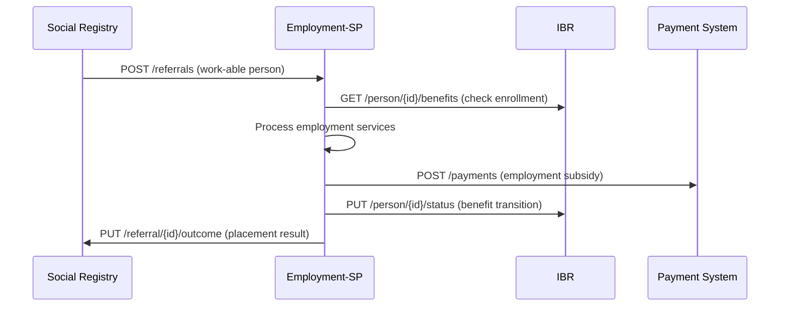

# Integration with DCI Interfaces

## Overview

The Employment-SP interoperability standards are designed as the **8th interface** within the Digital Convergence Initiative (DCI) ecosystem. This interface builds upon proven DCI patterns while introducing employment-specific capabilities that complement existing social protection infrastructure.

## DCI Ecosystem Architecture

### Core DCI Interfaces

The Employment-SP interface integrates with seven existing DCI interfaces:

| Interface | API Specification | Primary Purpose | Integration Points |
|-----------|------------------|-----------------|-------------------|
| **Civil Registration & Vital Statistics (CRVS)** | `registry_core_api_v1.0.0.yaml` | Person identity and vital events | Person verification, identity linking |
| **Integrated Beneficiary Registry (IBR)** | `ibr_api_v1.0.0.yaml` | Cross-program beneficiary coordination | Benefit enrollment status, case coordination |
| **Social Registry** | `social_api_v1.0.0.yaml` | Socio-economic assessment and targeting | Vulnerability assessment, work capacity |
| **Disability Registry** | `dr_api_v1.0.0.yaml` | Disability status and accommodations | Reasonable accommodations, specialized services |
| **Farmer Registry** | `fr_api_v1.0.0.yaml` | Agricultural worker identification | Rural employment, seasonal work patterns |
| **ID Systems** | *(Common schemas)* | Digital identity management | Authentication, authorization |
| **Payment Systems** | *(Disburse APIs)* | Benefit payment coordination | Employment subsidies, training allowances |

### Employment-SP as Integration Hub

The Employment-SP interface serves as a **coordination hub** that:
- **Receives referrals** from Social Registry based on work capacity assessments
- **Coordinates benefits** with IBR to ensure seamless transitions
- **Verifies identity** through CRVS for employment eligibility
- **Processes payments** through Payment Systems for training and employment subsidies
- **Accommodates disabilities** by integrating with Disability Registry

## Common DCI Standards Integration

### 1. Shared Data Objects (DO.COM.*)

Employment-SP inherits and extends common DCI data objects:

#### **DO.COM.01  Person**
```json
{
  "@context": "https://schema.spdci.org/employment/v1/",
  "@type": "Person",
  "identifiers": [
    {
      "identifier_type": "national_id",
      "identifier_value": "12345678901"
    }
  ],
  "name": {
    "given_name": "Maria",
    "surname": "Silva"
  },
  "birth_date": "1985-03-15"
}
```

**Employment Extensions**:
- Work capacity assessment status
- Employment history summary
- Skills and qualifications

#### **DO.COM.02  Identifier**
- Consistent person identification across all DCI interfaces
- Support for multiple identifier types (national ID, SSN, biometric)
- Unique identifier resolution for cross-system referrals

#### **DO.COM.03  Address & Location**
- Geographic targeting for employment services
- Rural vs. urban service delivery patterns
- Integration with Farmer Registry for agricultural areas

### 2. Authentication & Security Patterns

#### **OAuth2 JWT Standard**
Employment-SP follows DCI authentication patterns:

```yaml
securitySchemes:
  BearerAuth:
    type: http
    scheme: bearer
    bearerFormat: JWT
    description: |
      JWT token containing:
      - issuer: Government identity provider
      - audience: employment-sp-interface
      - scope: read:referrals write:placements
      - custom claims: agency_id, user_role
```

#### **Message Signatures**
All API calls include DCI-compliant message signatures:
- **Signature**: Detached JWS for message integrity
- **Header**: Standard DCI header with version, timestamp, action
- **Message**: Business payload with correlation IDs

### 3. Common Code Directories (CD.COM.*)

Employment-SP extends common DCI code directories:

#### **CD.COM.01  IdentifierType**
- `national_id`: Primary person identifier
- `social_security`: Employment benefit eligibility
- `employment_id`: PES system internal ID
- `tax_id`: Employment income verification

#### **CD.COM.02  MaritalStatus**
- Impacts benefit calculations and family employment support
- Coordinated with Social Registry assessment data

#### **CD.COM.06  RelationshipType**
- Household employment coordination
- Dependent care arrangements during training/employment

## Cross-Interface Integration Patterns

### 1. Person-Centric Data Flow



### 2. Event-Driven Coordination

#### **Employment Status Changes**
When employment status changes, Employment-SP notifies:
- **IBR**: Update benefit eligibility and amounts
- **Social Registry**: Update socio-economic status
- **Payment Systems**: Adjust payment schedules

#### **Benefit Transitions**
Coordinated benefit transitions between systems:
- **Social Assistance ’ Employment Training**: Seamless allowance transition
- **Unemployment Benefits ’ Employment Subsidies**: Graduated benefit reduction
- **Training Completion ’ Job Placement**: Outcome tracking coordination

### 3. Search and Discovery Patterns

#### **Cross-Registry Person Search**
```yaml
# DCI Standard Search Pattern
POST /search
{
  "signature": "...",
  "header": { ... },
  "message": {
    "search_criteria": {
      "identifier": "12345678901",
      "identifier_type": "national_id"
    },
    "registry_coordination": {
      "include_social_registry": true,
      "include_ibr_status": true,
      "include_disability_accommodations": true
    }
  }
}
```

## API Integration Specifications

### 1. Endpoint Alignment

Employment-SP follows DCI endpoint patterns:

| DCI Pattern | Employment-SP Implementation | Purpose |
|-------------|------------------------------|---------|
| `POST /{registry}/search` | `POST /employment/search` | Person discovery |
| `POST /{registry}/subscribe` | `POST /employment/subscribe` | Event notifications |
| `GET /{registry}/status/{id}` | `GET /employment/status/{id}` | Request tracking |
| `POST /{registry}/notify` | `POST /employment/notify` | Cross-system events |

### 2. Message Structure Compliance

#### **Standard DCI Message Format**
```json
{
  "signature": "eyJhbGciOiJSUzI1NiIs...",
  "header": {
    "version": "1.0.0",
    "message_id": "uuid",
    "message_ts": "2025-09-22T10:00:00.000Z",
    "action": "employment_referral",
    "sender_id": "SP-MIS-CHILE",
    "receiver_id": "PES-SENCE",
    "total_count": "1",
    "is_msg_encrypted": false
  },
  "message": {
    "@context": "https://schema.spdci.org/employment/v1/",
    "transaction_id": "uuid",
    "employment_referral": [
      { /* Employment-specific payload */ }
    ]
  }
}
```

### 3. Error Handling Standardization

Employment-SP uses DCI standard error codes:

```yaml
responses:
  '400':
    description: Bad Request
    content:
      application/json:
        schema:
          $ref: '#/components/schemas/ErrorResponse'
        examples:
          validation_error:
            summary: Invalid employment referral data
            value:
              error_code: "EMPL_INVALID_REFERRAL"
              error_message: "Work capacity assessment required"
              timestamp: "2025-09-22T10:00:00.000Z"
              correlation_id: "uuid"
```

## Government Interoperability Platform Integration

### Platform-Based Architecture

Countries implementing DCI standards often use Government Interoperability Platforms (GIP):

#### **Chile Model**: Government Interoperability Platform
- **Central API Gateway**: Single point for all cross-agency data exchange
- **Authentication Service**: Unified OAuth2 provider for all government systems
- **Message Routing**: Intelligent routing based on data types and agencies
- **Audit & Monitoring**: Centralized logging and compliance monitoring

#### **South Korea Model**: NBLSS Integration
- **Unified Welfare Database**: Central repository for all social protection data
- **Real-time Synchronization**: Live data updates across all agencies
- **AI-Enhanced Routing**: Machine learning for optimal service coordination

### Implementation Approaches

#### **Approach 1: Direct Integration**
- Point-to-point connections between Employment-SP and other DCI interfaces
- Suitable for countries with limited interoperability infrastructure
- Requires bilateral agreements and technical coordination

#### **Approach 2: Platform-Mediated Integration**
- All DCI interfaces connect through Government Interoperability Platform
- Platform handles authentication, routing, transformation, and auditing
- Preferred approach for scalable, multi-interface deployments

#### **Approach 3: Hybrid Model**
- Core integrations (Social Registry ” Employment-SP) direct
- Supplementary integrations (CRVS, Payment Systems) platform-mediated
- Balances performance with infrastructure requirements

## Implementation Scenarios

### Scenario 1: Single Interface Deployment

**Context**: Country implementing Employment-SP as first DCI interface

**Approach**:
1. **Foundation**: Establish DCI common schemas and authentication patterns
2. **Core Integration**: Focus on SP-MIS ” PES coordination
3. **Future Readiness**: Design APIs for eventual multi-interface integration

**Benefits**:
- Immediate value from employment-SP coordination
- Foundation for future DCI interface adoption
- Proven patterns for subsequent implementations

### Scenario 2: Multi-Interface Expansion

**Context**: Country with existing Social Registry or IBR seeking employment coordination

**Approach**:
1. **Leverage Existing**: Build on established DCI authentication and data patterns
2. **Incremental Integration**: Phase employment services into existing workflows
3. **Cross-Interface Optimization**: Enhance coordination across all implemented interfaces

**Benefits**:
- Accelerated implementation through existing infrastructure
- Enhanced service coordination across multiple programs
- Demonstrated DCI ecosystem value

### Scenario 3: Comprehensive DCI Ecosystem

**Context**: Country implementing multiple DCI interfaces simultaneously

**Approach**:
1. **Platform-First**: Establish Government Interoperability Platform
2. **Coordinated Rollout**: Implement interfaces in logical dependency order
3. **Ecosystem Optimization**: Design for cross-interface data flows and service coordination

**Recommended Sequence**:
1. **Foundation**: ID Systems + Common Schemas
2. **Core Social Protection**: Social Registry + IBR
3. **Service Delivery**: Employment-SP + Payment Systems
4. **Specialized Services**: CRVS + Disability Registry + Farmer Registry

## Quality Assurance & Testing

### DCI Compliance Testing

#### **Schema Validation**
- JSON-LD schema compliance testing
- @context resolution verification
- Cross-interface data compatibility

#### **API Compliance**
- OpenAPI specification validation
- Authentication pattern verification
- Message structure compliance

#### **Integration Testing**
- Cross-interface data flow validation
- Event notification reliability
- Error handling consistency

### Performance Benchmarks

Based on operational DCI implementations:

| Metric | Target | Chile Performance | South Korea Performance |
|--------|--------|------------------|------------------------|
| **Cross-interface response time** | < 5 seconds | 2.1 seconds | 1.8 seconds |
| **Data consistency** | > 99% | 98.7% | 99.2% |
| **Authentication success** | > 99.5% | 99.8% | 99.9% |
| **Message delivery** | > 99.9% | 99.95% | 99.97% |

## Future Evolution

### Emerging DCI Patterns

#### **AI-Enhanced Coordination**
- Machine learning for optimal service routing
- Predictive analytics for intervention timing
- Automated quality assurance and fraud detection

#### **Real-Time Analytics**
- Cross-interface performance monitoring
- Beneficiary outcome tracking
- Program effectiveness measurement

#### **Mobile-First Integration**
- DCI mobile app frameworks
- Beneficiary self-service portals
- Real-time status updates and notifications

### Standards Evolution

The Employment-SP interface will evolve with DCI ecosystem enhancements:
- **Version Compatibility**: Backward-compatible API versioning
- **Extension Points**: Country-specific customizations within DCI framework
- **Interoperability Testing**: Automated compliance verification tools
- **Community Contributions**: Open-source reference implementations

---

## Implementation Support

### Getting Started

1. **Review DCI Common Standards**: Understand shared authentication, data objects, and message patterns
2. **Assess Current Integration**: Evaluate existing connections to other DCI interfaces
3. **Plan Integration Approach**: Choose direct, platform-mediated, or hybrid integration model
4. **Implement Incrementally**: Start with core Employment-SP functionality, expand cross-interface coordination

### Resources

- **DCI Standards Portal**: [standards.spdci.org](https://standards.spdci.org/)
- **Technical Documentation**: OpenAPI specifications in `dci-standards/release/`
- **Discussion Forum**: [GitHub Discussions](https://github.com/orgs/spdci/discussions)
- **Reference Implementations**: Country case studies in [Country Examples](./country-examples.md)

---

**Next**: [Country Case Examples](./country-examples.md) for real-world DCI integration patterns
**Related**: [Challenges & Lessons Learned](./challenges-lessons-learned.md) for implementation guidance