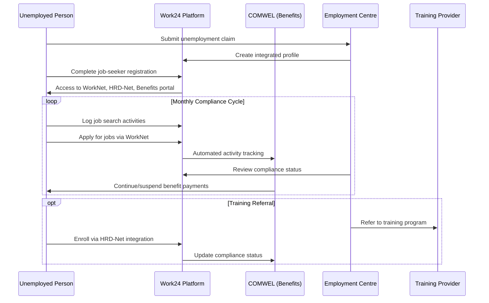

# South Korea: Work24 Employment-SP Integration Case Study

## Executive Summary

South Korea demonstrates advanced Employment-SP interoperability through the **Work24 integrated employment portal**, which consolidates unemployment insurance, job matching, training services, and social welfare coordination into a unified digital platform. The system exemplifies tight coupling between contributory unemployment protection and active labor market policies, supported by sophisticated digital infrastructure and institutional co-location models.

**Key Innovation**: The **Employment Welfare Plus Centres** represent institutional interoperability, co-locating employment services (MoEL) with welfare offices (local governments/MoHW) to enable seamless referrals and case management for complex situations.

## System Overview

### Core Platform: Work24 (고용24)

**Launch**: 2023 by Korea Employment Information Service (KEIS)
**Purpose**: Unified digital gateway for employment services and unemployment benefits
**Integration Scope**: Consolidates 9 previously separate employment information systems

**Integrated Components**:
- **WorkNet**: Job matching platform with AI-powered recommendations
- **Employment Insurance Portal**: Unemployment benefit applications and monitoring
- **HRD-Net**: Vocational training and skills development programs
- **NESP Portal**: National Employment Support Programme for disadvantaged groups

### Institutional Framework

**Policy Oversight**:
- **Ministry of Employment and Labor (MoEL)**: Policy setting, contribution rates, benefit levels
- **Korea Workers' Compensation & Welfare Service (COMWEL)**: Fund administration, benefit payments
- **Korea Employment Information Service (KEIS)**: IT systems development and maintenance

**Service Delivery**:
- **State Job Centres**: Employment services and benefit administration
- **Employment Welfare Plus Centres**: Co-located employment and welfare services (100+ locations)
- **Local Welfare Offices**: Social protection services and case management

## Use Case A: Employment Insurance Integration

### Employment Insurance Scheme (EIS) Overview

**Coverage**: Most wage workers under Labour Standards Act (expanded to platform workers)
**Financing**: Mandatory employer-employee contributions (rates vary by firm size)
**Benefit Types**:
1. **Job-Seeking Allowance (구직급여)**: Income replacement during unemployment
2. **Employment Promotion Allowances**: Early re-employment, training, relocation support

### Conditionality Framework

**Eligibility Requirements**:
- Involuntary unemployment with contribution history
- Able to work and available for employment
- Registration with Employment Security Centre
- Active job search demonstration

**Activation Obligations**:
- **Initial Registration**: Complete job-seeker registration (구직신청서) within one week
- **Re-employment Workshop**: Mandatory orientation on job search and system use
- **Regular Reporting**: Monthly unemployment recognition (실업인정) cycles
- **Training Participation**: Accept suitable training referrals as directed

### Digital Integration Process

**Compliance Monitoring**:
- **Automated Tracking**: Work24 records all platform activities (applications, searches, profile updates)
- **Job Diary Mobile App**: Daily activity logging that syncs with Work24 profile
- **Caseworker Dashboard**: Integrated view of benefits, training, job search history
- **Cross-system Validation**: Integration with social insurance databases for employment detection

### Data Objects and Integration

**Core Data Elements**:
- **Unified Profile**: Single identity across all employment and training services
- **Job Search History**: Applications, interviews, offers, rejections
- **Training Records**: Course enrollment, progress, completion status
- **Benefit Status**: Payment history, compliance events, sanctions
- **Employment Detection**: Real-time integration with social insurance registration

**Cross-system Integration**:
- **Social Insurance Databases**: Automatic employment detection triggers benefit suspension
- **Happiness e-eum System**: Social security information system for broader welfare coordination
- **AI Matching Engine**: Big data analytics for job recommendations and placement optimization

## Use Case B: Employment Welfare Plus Centres Model

### Institutional Interoperability

**Co-location Model**: 100+ centres integrate employment services (MoEL) with welfare offices (local governments/MoHW) under one roof

**Service Integration**:
- **Employment Services**: Job counselling, placement, training referrals (MoEL staff)
- **Welfare Support**: Livelihood assistance, benefit applications, case management (local government staff)
- **Financial Services**: Credit counselling, microfinance support (NGO partners)
- **Mental Health**: Counselling and support services (specialized providers)

### Digital Referral System

**Two-way Electronic Referrals**:
- **Welfare → Employment**: Welfare caseworkers refer clients to employment services via digital system
- **Employment → Welfare**: Employment counsellors trigger livelihood assistance referrals
- **Case Management Groups**: Multi-agency teams coordinate support for complex cases

**Technical Implementation**:
- **Integrated Information Systems**: Secure data sharing between employment and welfare databases
- **Referral Tracking**: Electronic monitoring of cross-referral outcomes and follow-up
- **Reduced Processing Times**: Streamlined application processes across service areas

### Target Population Integration

**National Employment Support Programme (NESP)**:
- **Target Groups**: Low-income job seekers, unemployed youth, women returning to workforce
- **Integrated Approach**: Employment counselling + livelihood support + financial services
- **Work24 Integration**: NESP portal consolidated into unified platform for seamless access

## Legal Framework

### Primary Legislation

**Employment Insurance Act (고용보험법)**:
- **Article 40**: Benefit eligibility contingent on work availability and active job search
- **Suspension Authority**: MoEL empowered to suspend benefits for non-compliance
- **Training Integration**: Employment Insurance Fund finances vocational training for unemployed

**Supporting Laws**:
- **Vocational Skills Development Act**: Framework for training integration with unemployment benefits
- **Personal Information Protection Act**: Data protection requirements for cross-system integration
- **Social Security Basic Act**: Foundation for inter-agency coordination and data sharing

### Regulatory Framework

**Unemployment Recognition Regulation (2019)**:
- **Reporting Requirements**: Regular intervals (2-4 weeks) for job search demonstration
- **Acceptable Activities**: Job applications, interviews, training participation, job fair attendance
- **Sanction Procedures**: Benefit suspension for non-compliance without just cause

**Data Sharing Agreements**:
- **Inter-agency MOUs**: Formal agreements enabling data exchange between employment and welfare systems
- **Privacy Safeguards**: Purpose limitation and access controls for personal information
- **Audit Requirements**: Regular compliance monitoring and data protection assessments

## Technical Architecture

### Work24 Platform Integration

**Single Sign-On**: Unified authentication across all employment services
**Integrated Dashboard**: Consolidated view for both users and caseworkers
**Mobile Optimization**: Responsive design with dedicated mobile applications
**AI Integration**: Machine learning for job matching and service recommendations

### Data Integration Patterns

**Real-time Integration**:
- **Employment Detection**: Immediate benefit suspension when new employment registered
- **Compliance Monitoring**: Automated tracking of job search activities and training participation
- **Cross-system Alerts**: Notifications for status changes across benefit and employment systems

**Batch Processing**:
- **Performance Analytics**: Aggregate reporting on placement rates and program outcomes
- **Data Warehousing**: Historical analysis for policy development and service improvement

### Security and Privacy

**Data Protection Measures**:
- **Access Controls**: Role-based permissions for different user types and agencies
- **Encryption**: Secure data transmission and storage across integrated systems
- **Audit Logging**: Comprehensive tracking of all data access and system interactions

**Privacy Compliance**:
- **Consent Management**: Clear user consent for data sharing across services
- **Purpose Limitation**: Data use restricted to authorized employment and welfare functions
- **Data Minimization**: Share only information necessary for specific service delivery

## Implementation Outcomes

### Quantitative Results

**System Consolidation**:
- **Platform Integration**: 9 separate systems consolidated into unified Work24 portal
- **Service Coverage**: 100+ Employment Welfare Plus Centres operational (out of 174 total employment centres)
- **User Experience**: Single login access to all employment services and benefit applications

**Service Delivery Improvements**:
- **Processing Time**: Reduced application processing through digital integration
- **Cross-referrals**: Electronic referral system enabling seamless service coordination
- **Compliance Monitoring**: Automated tracking reducing administrative burden

### Qualitative Improvements

**User Experience**:
- **Service Accessibility**: One-stop access to employment, training, and welfare services
- **Reduced Bureaucracy**: Elimination of duplicate applications and documentation
- **Personalized Services**: AI-powered recommendations based on integrated profile data

**Caseworker Efficiency**:
- **Integrated View**: Complete client history across employment and welfare services
- **Coordination Tools**: Electronic referral and case management capabilities
- **Data-driven Decisions**: Analytics supporting evidence-based service delivery

## Key Success Factors

### Technical Success Factors

1. **Unified Platform Strategy**: Consolidation of fragmented systems into single digital gateway
2. **Real-time Integration**: Immediate data exchange enabling responsive service delivery
3. **Mobile Optimization**: Accessible design accommodating diverse user needs and preferences
4. **AI Enhancement**: Machine learning improving job matching and service recommendations

### Institutional Success Factors

1. **Co-location Model**: Physical integration of employment and welfare services reducing institutional silos
2. **Electronic Referrals**: Digital systems enabling seamless cross-agency coordination
3. **Shared Case Management**: Multi-agency teams addressing complex client needs holistically
4. **Performance Monitoring**: Integrated analytics supporting continuous service improvement

### Policy Success Factors

1. **Legal Integration**: Statutory framework linking unemployment benefits to employment activation
2. **Funding Coordination**: Employment Insurance Fund financing both benefits and training programs
3. **Governance Alignment**: Clear agency roles and responsibilities in integrated service delivery
4. **Privacy Framework**: Comprehensive data protection enabling secure information sharing

## Implementation Challenges

### Technical Challenges

**System Complexity**:
- **Legacy Integration**: Consolidating 9 separate systems with different technical architectures
- **Data Standardization**: Harmonizing data formats and definitions across previously separate systems
- **Performance Management**: Ensuring system reliability under high user loads

**Interoperability Challenges**:
- **Cross-agency Integration**: Technical coordination between employment (MoEL) and welfare (local government) systems
- **Real-time Requirements**: Maintaining system performance for immediate employment detection and benefit adjustments

### Operational Challenges

**Change Management**:
- **Staff Training**: Preparing caseworkers for integrated service delivery model
- **Process Redesign**: Adapting workflows to leverage new digital capabilities
- **Cultural Integration**: Building collaboration between employment and welfare staff

**Service Delivery Challenges**:
- **Digital Divide**: Ensuring accessibility for users with limited digital literacy
- **Geographic Coverage**: Extending co-location model to all regions and rural areas
- **Capacity Management**: Scaling integrated services to meet demand

### Policy Challenges

**Privacy and Data Protection**:
- **Consent Management**: Balancing service integration with individual privacy rights
- **Data Governance**: Ensuring appropriate use of integrated personal information
- **Inter-agency Coordination**: Managing data sharing responsibilities across different government levels

## Lessons for DCI Standards

### Process Standards (PRS.EMPL.xx)

**Integrated Service Delivery**:
- **Co-location Benefits**: Physical integration of employment and welfare services improves coordination
- **Electronic Referrals**: Digital systems essential for seamless cross-agency service delivery
- **Unified Registration**: Single registration process reduces bureaucratic burden on users

**Conditionality Implementation**:
- **Real-time Monitoring**: Automated compliance tracking more effective than manual reporting
- **Graduated Sanctions**: Clear progression from warnings to benefit suspension
- **Training Integration**: Employment Insurance Fund financing both benefits and activation programs

### Data Standards (DO.EMPL.xx)

**Integrated Data Model**:
- **Unified Identity**: Single person identifier across employment and welfare systems
- **Comprehensive Profile**: Integration of job search, training, and benefit history
- **Cross-system Status**: Real-time employment detection and benefit coordination

**Compliance Monitoring**:
- **Activity Logging**: Standardized job search activity data objects
- **Training Records**: Integration of skills development with employment services
- **Outcome Tracking**: Placement and retention monitoring across integrated services

### API Standards (API.EMPL.xx)

**Platform Integration**:
- **Single Sign-On**: Unified authentication across multiple service components
- **Real-time Data Exchange**: Immediate updates for employment status and benefit eligibility
- **Mobile-first Design**: APIs optimized for mobile applications and responsive interfaces

**Inter-agency Coordination**:
- **Secure Data Sharing**: Encrypted APIs for cross-agency information exchange
- **Electronic Referrals**: Standardized referral data objects and workflow automation
- **Audit Trails**: Comprehensive logging for accountability and performance monitoring

---

**Evidence Sources**:
- ILO Assessment of Country Cases SP-PES Linkage (2025)
- Korea Employment Information Service (KEIS) Documentation (2024)
- OECD Strengthening Active Labour Market Policies in Korea (2024)
- MoEL Employment and Labor Policy in Korea (2024)

`TODO(evidence)`: Document specific API protocols for Work24 integration
`TODO(evidence)`: Validate data sharing agreements between MoEL and local governments
`TODO(evidence)`: Add performance metrics for integrated service delivery model